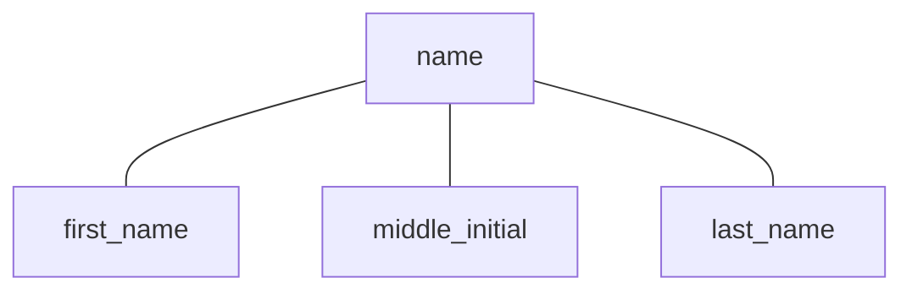
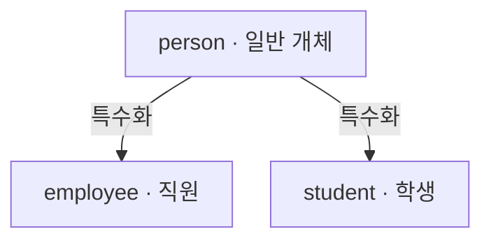

> [!note] Supplementary Materials
> [Database System Concepts (7th Edition)](https://db-book.com/slides-dir)
> - `6. Database Design Using the E-R Model`

## 핵심
- UML에서는 카디널리티 표기의 위치가 ER 표기와 반대라는 점에 주의해야 한다.

## 0. 데이터베이스 설계 단계
> 실세계의 요구사항을
> 엔터티, 속성, 관계, 제약조건으로 구조화한 뒤,
> 이를 실제 관계형 데이터베이스의 테이블로 변환하는 방법이다.

1. **요구사항 분석**
	- 사용자가 필요로 하는 데이터와 수행할 업무·트랜잭션을 파악한다.
	- 수집: 기존 문서, 인터뷰, 설문 등을 통해 필요한 데이터를 조사한다.
	- 분석: 엔터티, 속성, 관계와 자주 수행할 연산을 파악한다.

2. **개념적 설계**
	- DBMS와 독립적으로 현실 세계를 모델링한다.
	- 개념적 스키마를 작성한다. 
	- ER 모델의 경우, 엔터티, 관계, 속성, 키, 제약조건을 표현하고, ER 다이어그램으로 작성한다.

3. *DBMS 선정*
	- 데이터 모델, 저장 구조, 인터페이스, 질의어 등의 기술적 요소를 검토한다.
	- 구입·유지보수·교육·변환 비용과 조직의 전략도 고려한다.

4. **논리적 설계**
	- ER 스키마를 선택한 DBMS의 데이터 모델에 맞게 변환한다.
	- RDBMS라면 ER 모델을 테이블 구조(릴레이션)로 변환한다.

5. **정규화**
	- 데이터 중복과 삽입·삭제·갱신 이상이 발생하는지 검사한다.
	- 문제가 있다면 더 좋은 형태의 관계 스키마로 분해한다.

6. **물리적 설계**
	- 데이터의 **저장 구조, 인덱스** 등 실제 물리적 배치를 결정한다.
	- 응답 시간, 초당 트랜잭션 처리량, 보고서 생성 시간 등을 고려한다.

7. *트랜잭션 설계 및 구현*
	- 완성된 데이터베이스에서 실행할 프로그램과 연산을 설계한다.
	- 데이터베이스 스키마는 트랜잭션이 요구하는 정보를 모두 포함해야 한다.

### 좋은 설계
좋은 설계는 다음 두 문제를 피해야 한다.
- **중복성**: 같은 정보가 여러 곳에 저장되어 불일치가 발생하는 문제
- **불완전성**: 필요한 현실 세계의 개념을 표현하지 못하는 문제

> 중복이 적고, 무결성을 유지하며, 접근이 효율적이고, 변화하는 데이터를 표현하면서도 이해하기 쉬워야 한다.

## 1. 개념적 설계와 ER 스키마
**ER Model** (Entity-Relationship Model; 엔터티-관계 모델)
- 실세계를 엔터티, 속성, 관계 및 제약조건으로 표현한다.

- 데이터베이스 설계를 용이하게 하기 위해, 개체와 개체 간의 관계를 이용해 실세계를 개념적 구조로 모델링한 개념적 데이터 모델이다.
- 엔터티, 관계, 프로세스, 무결성 제약조건을 나타내는 추상화된 뷰로 표현한다.
- 기본적인 구문으로는 엔터티, 관계, 속성이 있고 기타 구문으로는 카디널리티 비율, 참여 제약조건 등이 있다.
- Peter Chen이 1976년에 제안했다.

### 1.1. 엔터티
**엔터티 타입** (Entity Type)
- 동일한 속성(Attribute)들을 가진 엔터티들의 구조를 의미한다.
- ER 다이어그램에서 직사각형으로 표현된다.
- 예: 학생 엔터티 타입 - 속성: 학번, 이름, 학과, 학년

**엔터티** (Entity / Entity Instance)
- 엔터티 타입에 의해 정의된 하나의 개체(인스턴스)이다.
- 예: (학번: 20240001, 이름: 김철수, 학과: 컴퓨터공학, 학년: 1)이라는 특정 학생 1명

**엔터티 집합** (Entity Set)
- 특정 시점에 데이터베이스에 존재하고 있는 특정 엔터티 타입의 모든 엔터티(인스턴스)들의 모임이다.
- 예: 현재 데이터베이스의 학생 테이블에 저장된 모든 학생 데이터들의 집합

각 엔터티는 속성으로 설명되며, 일부 속성이 엔터티를 고유하게 식별하는 기본키가 된다.
```
student(ID, name, tot_cred)
course(course_id, title, credits)
```

#### 강한 엔터티와 약한 엔터티
**강한 엔터티**
- 자신의 키만으로 각 엔터티를 식별할 수 있다.

**약한 엔터티**
- 자체 속성만으로는 그 엔터티를 고유하게 식별할 수 없다.
- 다른 강한 엔터티의 키가 필요하다.

```
course(course_id, ...)
section(sec_id, semester, year, ...)
```
`section`은 `sec_id`, `semester`, `year`만으로 전체 대학에서 고유하지 않을 수 있으므로 소속 강좌의 `course_id`가 필요하다.

**약한 엔터티의 기본 키**
- 식별(소유) 엔터티의 기본 키와, 자신의 부분 키(판별자)를 결합해 만든다.

```
section의 기본키
= (course_id, sec_id, semester, year)
```

**약한 엔터티의 표기법**은 다음과 같다.
- 약한 엔터티: 이중 사각형
- 식별 관계: 이중 마름모
- 판별자(discriminator): 점선 밑줄
- 약한 엔터티는 식별(소유) 관계에 전체 참여한다.

### 1.2. 속성
**속성 (Attribute)**
- 엔터티 또는 관계의 특성을 나타낸다.
- 요구사항 명세에서 명사나 형용사로 표현된다.
- ER 다이어그램에서는 **타원**으로 표현한다.

#### 키 속성
키 속성에는 밑줄을 그어 표현한다.
부분 키는 점선 밑줄로 표현한다.

#### 속성의 종류
**단순 속성** (simple attribute)
- 더 이상 분해할 수 없다.
- 예: 급여
- ER 다이어그램: 실선 타원
**복합 속성** (composite attribute)
- 여러 하위 속성으로 분해 가능하다.
- 예: 주소 → 시, 구, 동

**단일값 속성** (single-valued attribute)
- 각 엔터티마다 하나의 값을 가진다.
- 예: 사원번호
**다중값 속성** (multi-valued attribute)
- 각 엔터티마다 여러 값을 가질 수 있다.
- 예: 프로젝트 진행 위치
- ER 다이어그램: 이중선 타원

**저장 속성** (stored attribute)
- 다른 속성과 독립적으로 존재한다.
- *데이터베이스에 직접 저장한다.*
- 예: 가격
**유도 속성** (derived attribute)
- 다른 속성의 값으로부터 계산되어 얻어진다.
- *가능하면 속성으로 포함시키지 않고 계산하여 사용한다.*
- 예: 생년월일로 계산한 나이
- ER 다이어그램: 점선 타원

주의할 점은 다음과 같다.
- 다치 속성은 관계형 모델로 변환할 때 보통 **별도의 테이블**로 만든다.
- 유도 속성은 다른 데이터로 계산할 수 있다면 중복 저장하지 않는 것이 좋다.
- 복합 속성은 관계형 모델에서 하위 단순 속성들로 분해한다.

### 1.3. 관계
**관계 타입** (Relationship Type)
- 2개 이상의 엔터티 타입 사이에 존재하는 연관성의 구조를 의미한다.
- 요구사항 명세에서 흔히 동사에 가깝게 표현된다.
- ER 다이어그램에서 마름모로 표현되며, 엔터티 타입들과 연결된다.
- 예: 학생 엔터티 타입과 과목 엔터티 타입 간의 수강 관계 타입

```
사원이 부서에 소속된다.
사원이 프로젝트에서 근무한다.
공급자가 부품을 공급한다.
```

**관계** (Relationship / Relationship Instance)
- 개별 엔터티 인스턴스들 사이에 실제로 성립된 구체적인 연결 1개이다.
- 예: 김철수(학생)가 데이터베이스(과목)를 수강한다.

**관계 집합** (Relationship Set)
- 특정 시점에 데이터베이스에 존재하는 동일한 관계 타입의 모든 관계(인스턴스)들의 모임이다.
- 예: 현재 데이터베이스에 등록되어 있는 모든 학생들의 수강 신청 내역 전체 집합

**관계의 속성**
- 관계 자체도 관계의 특징을 기술하는 속성을 가질 수 있다. (예: 학생이 언제 지도교수에게 배정되었는지를 표현하려면 `advisor` 관계에 `date` 속성을 둘 수 있다.)
- 관계의 인스턴스는 참여한 엔터티들의 키 조합으로 식별하므로, 관계 자체에는 일반적으로 별도의 키 속성을 두지 않는다.

#### 관계의 차수
**관계의 차수** (degree)
- 관계에 참여하는 엔터티 집합의 수이다.

**1진 관계**
- 하나의 엔터티 집합이 자기 자신과 관계한다.
**2진 관계** (이항)
- 두 엔터티 집합이 참여한다.
- 대부분의 관계는 이항 관계이다.
**3진 관계** (삼항)
- 세 엔터티 집합이 참여한다.
- `교수가 특정 프로젝트에서 특정 학생을 지도한다`처럼 세 대상의 조합이 중요하면 삼항 관계가 적합하다.

**순환적 관계**
- 같은 엔터티 집합이 하나의 관계에 두 번 참여할 때는 역할(role) 이름을 사용한다.
- 예를 들어 강좌의 선수과목 관계에서는 `course_id`와 `prereq_id`가 서로 다른 역할을 나타낸다.

#### 카디널리티 비율 제약
**관계의 카디널리티 비율**
- 카디널리티는 한 엔터티가 관계를 통해 상대편의 몇 개 엔터티와 연결될 수 있는지를 나타낸다.

**관계 집합의 키**
- 관계는 참여하는 엔터티의 기본키를 이용해 식별한다.
- 최소 기본키는 카디널리티에 따라 달라진다.

**1:1 관계**
- 양쪽 모두 최대 하나와 연결된다.
- *이 관계 집합 테이블의 기본키: 어느 한쪽의 기본키*

**1:N 관계**
- 한쪽은 여러 개, 반대쪽은 최대 하나와 연결된다.
- *이 관계 집합 테이블의 기본키: N쪽 엔터티의 기본키*

**M:N 관계**
- 양쪽 모두 여러 개와 연결된다.
- *이 관계 집합 테이블의 기본키: 양쪽 엔터티 기본키의 조합*

**최소·최대 카디널리티**
- 관계 타입과 엔터티 타입을 연결하는 실선 위에 `(min, max)` 형식으로 관계 참여 횟수를 나타낸다.
- `min = 0`: 관계 참여가 선택적
- `min = 1`: 반드시 한 번 이상 참여
- `max = 1`: 최대 하나와 연결
- `max = *`: 개수 제한 없이 연결

#### 참여 제약
**전체 참여**
- 모든 엔터티가 반드시 관계에 참여한다.
- 최소 카디널리티가 1이다.
- ER 다이어그램(Chen 표기법)에서는 이중선으로 표현한다.
- *약한 엔터티는 소유 관계에 항상 전체 참여한다.*

**부분 참여**
- 관계에 참여하지 않는 엔터티가 존재할 수 있다.
- 최소 카디널리티가 0이다.

`최소..최대`로도 표현할 수 있다.
- `0..*`: 참여하지 않거나 여러 번 참여 가능
- `1..1`: 반드시 정확히 한 번 참여
- `0..1`: 선택적으로 최대 한 번 참여

#### 다중 관계
- 두 엔터티 타입 사이에 두 개 이상의 관계 타입이 존재할 수 있다.

## 2. ER 다이어그램
### 작성 절차
1. 응용 분야의 요구사항을 수집한다.
2. 엔터티 타입을 찾는다.
3. 관계 타입을 찾는다.

4. 각 관계가 1:1, 1:N, M:N 중 어디에 해당하는지 결정한다.
5. 엔터티와 관계의 속성 및 도메인을 결정한다.
6. 후보 키와 기본 키를 결정한다.

7. ER 다이어그램을 작성합니다.
8. 다이어그램이 요구사항을 빠짐없이 반영하는지 검사한다.
9. ER 스키마를 관계형 데이터베이스 스키마로 변환한다.

### ER 표기법과 IE 표기법의 변환
실무 도구에서는 공간을 많이 차지하는 Chen 표기법 대신 **IE 또는 새발표기법**(Crow’s Foot)을 많이 사용한다.

![[ER & IE.png]]

## 3. 논리적 설계와 RDB 스키마
> ER 모델을 릴레이션으로 사상한다.

- 논리적 설계 단계에서는 ER 스키마를 관계 데이터 모델의 릴레이션들로 사상한다.
- ER 스키마에는 엔터티 타입과 관계 타입이 존재하지만 관계 데이터베이스에는 엔터티 타입과 관계 타입을 구분하지 않고 릴레이션들만 있다.

ER 개념과 DB 개념의 대응 관계
- ER 다이어그램 - 관계 데이터베이스
- 엔터티 타입 - 릴레이션
- 단순 애트리뷰트 - 애트리뷰트
- 관계 - 외래키
- 2진 이상의 관계 - 릴레이션
- 다치 애트리뷰트 - 릴레이션

### 강한 엔터티
엔터티의 속성을 그대로 테이블 열로 변환한다.

```
student(ID, name, tot_cred)
```

### 약한 엔터티
약한 엔터티의 속성에 식별 엔터티의 기본키를 외래키로 추가한다.
- 따라서 약한 엔터티의 기본 키는 `식별 엔터티의 기본키 + 약한 엔터티의 부분키`가 된다.

```
section(course_id, sec_id, semester, year)
```

### 복합 속성
복합 속성은 하위의 단순 속성들로 분해하여 저장한다.



### 다중값 속성
다중값 속성마다 별도의 테이블을 만든다.

```
instructor(ID, ...)
inst_phone(ID, phone_number)
```
전화번호가 두 개면 `inst_phone`에 두 행이 저장된다.

### 2진 1:1 관계
**한쪽 테이블에 상대방의 기본 키를 외래 키로 넣는다.**
- 전체 참여하는 쪽에 외래 키를 두는 것이 일반적으로 유리하다.
- 관계의 속성도 해당 테이블에 함께 포함한다.
- 경우에 따라 별도 관계 테이블을 만들거나 두 엔터티를 통합할 수도 있다.

```
프로젝트마다 한 명의 관리자가 있다.
한 사원은 두 개 이상의 프로젝트 관리자가 될 수는 없다.
각 프로젝트에 대해 시작 날짜, 관리자를 나타낸다.

PROJECT(Projno, Projname, Budget, StartDate, Manager)
```

### 2진 1:N 관계
N쪽 테이블에 1쪽의 기본키를 외래키로 추가하면 별도 관계 테이블을 생략할 수 있다.
- 다만 참여가 선택적이면 외래키에 `NULL`이 많이 발생할 수 있다.
- 약한 엔터티와 식별 엔터티 사이의 식별 관계도 약한 엔터티 테이블에 이미 식별 엔터티의 키가 들어가므로 별도 관계 테이블이 필요하지 않다.

```
instructor(ID, name, salary, dept_name)
```

### 2진 M:N 관계
M:N 관계는 참여 엔터티의 기본키와 관계 속성을 포함하는 별도의 테이블로 변환한다.
- `첫 번째 엔터티의 외래키 + 두 번째 엔터티의 외래키`가 기본키가 된다.
- 관계의 속성도 이 테이블에 포함한다.

```
advisor(student_ID, instructor_ID, date)
```

### 3진 이상의 관계
관계에 참여하는 엔터티들의 기본 키를 외래 키로 갖는 **별도의 릴레이션**을 생성한다.
- 일반적으로 외래 키들의 조합이 기본 키가 된다.
- 카디날리티가 `1:N:N`이라면 1측 외래 키가 기본 키 조합에서 제외될 수 있다.

## 4. 확장 ER 모델
### 특수화와 일반화
- **특수화**: 상위 엔터티를 특징에 따라 하위 엔터티로 나누는 **하향식 설계**
- **일반화**: 공통 특징을 가진 여러 엔터티를 상위 엔터티로 묶는 **상향식 설계**
- 하위 엔터티는 상위 엔터티의 속성과 관계 참여를 상속한다.

예:


주요 제약은 다음과 같다.
- **서로소(disjoint)**: 하나의 상위 엔터티가 최대 하나의 하위 집합에만 속함
- **중첩(overlapping)**: 여러 하위 집합에 동시에 속할 수 있음
- **전체 특수화**: 모든 상위 엔터티가 적어도 하나의 하위 집합에 속함
- **부분 특수화**: 어느 하위 집합에도 속하지 않을 수 있음

### 관계형 스키마 변환 방법
1. 상위 엔터티 테이블과 각 하위 엔터티 테이블을 따로 생성
	- 중복이 적음
	- 전체 정보를 얻으려면 조인이 필요

2. 하위 엔터티마다 상속받은 속성을 모두 포함한 테이블 생성
	- 조회가 간단함
	- 중첩 특수화에서는 공통 정보가 중복될 수 있음

### 집성
**집성** (Aggregation)
- **관계 집합 자체를 하나의 추상적인 엔터티처럼 취급**하는 기법이다.
- 이를 통해 **관계와 다른 엔터티 사이의 관계**를 표현할 수 있다.
- 예: 교수·학생·프로젝트의 지도 관계 전체에 대해 평가 엔터티를 연결할 수 있다.

## 5. 설계 시 중요한 판단
- 어떤 정보를 단순 속성으로 둘지, 별도 엔터티로 만들지
- 현실의 행동이나 연관성을 엔터티로 표현할지 관계로 표현할지
- 관계의 속성을 어느 엔터티에 잘못 넣고 있지는 않은지
- 삼항 관계를 사용할지 여러 이항 관계로 나눌지
- 강한 엔터티와 약한 엔터티 중 무엇이 적절한지
- 특수화·일반화가 설계를 더 명확하게 만드는지
- 관계 자체를 다시 관계에 참여시켜야 한다면 집성이 필요한지

전화번호처럼 여러 값을 가지거나 통신사·유형 등의 추가 정보가 필요한 대상은 단순 속성보다 별도 엔터티로 만드는 것이 적절할 수 있다.

삼항 관계는 언제나 이항 관계와 인공 엔터티로 변환할 수 있지만, 원래의 의미와 제약조건이 완전히 보존되지 않을 수 있다. 따라서 단순히 테이블 수를 줄이는 것보다 현실 세계의 의미를 정확히 표현하는 것이 우선이다.
