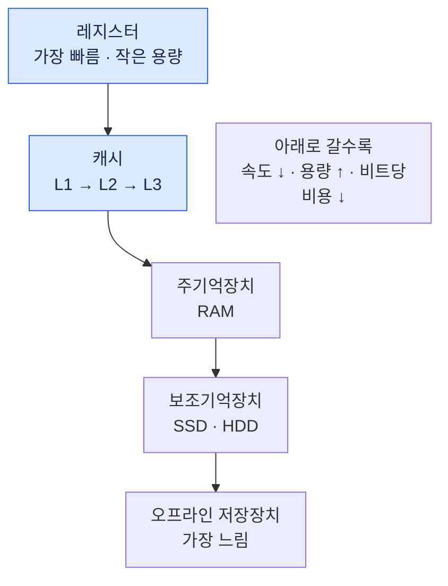

## 1. 컴퓨터 구성 요소
### 1.1. 운영체제의 정의
- 시스템 관점에서의 운영체제: 자원 관리자 (Resource Manager)
	- 물리적 자원: CPU, 메모리, 보조기억장치, I/O, 네트워크
	- 추상적 자원: 프로세스, 페이지, 세그먼트, 파일, 디렉터리, 통신 프로토콜

### 1.2. 하드웨어 구성요소
- **처리기(CPU)**
	- ALU(연산), 제어 유닛, 레지스터로 구성
	- x86, ARM 등 다양한 종류 존재
****
- **주기억장치(RAM)**
	- 휘발성
	- 데이터와 프로그램 저장

- **저장 장치**
	- 비휘발성
	- 디스크, SSD, Flash Memory 등

- **입출력 장치**
	- 키보드/마우스(입력)
	- 모니터/프린터(출력)

- **통신 장치**
	- 이더넷, Bluetooth, CDMA 등

### 1.3. 마이크로프로세서의 발전
- **마이크로프로세서**: 단일 칩에 하나의 프로세서 집적 → 멀티코어로 발전
- **GPU**: 단일 명령 다중 데이터(SIMD) 처리, 그래픽 및 범용 수치 연산
- **DSP**: 오디오·비디오 스트림 신호 처리 전용 프로세서
- **SoC**: CPU, 캐시, GPU, DSP, I/O, 주기억장치를 하나의 칩에 통합

### 1.4. 주요 레지스터
- **MAR**: 메모리 주소 레지스터
- **MBR**: 메모리 버퍼 레지스터

- **제어 및 상태 레지스터**
	- **PC (Program Counter)**: ==다음에 실행할 명령어 주소==
	- **IR (Instruction Register)**: 현재 실행 중인 명령어
	- **PSW (Program Status Word)**: 인터럽트 활성화, 슈퍼바이저/유저 모드, 조건 코드 관리

## 2. 명령어 실행
**명령어 사이클** (Instruction Cycle)
- **반입(Fetch) → 수행(Execute)** 2단계로 구성됨
1. PC가 가리키는 주소에서 명령어를 메모리로부터 읽어 IR에 저장
2. PC 값을 증가
3. IR의 명령어를 해석하고 실행
4. 반복

**명령어 범주**
- 처리기-메모리 전달
- 처리기-I/O 전달
- 데이터 처리(산술·논리)
- 제어(분기)

### 2.1. 프로세스 메모리 레이아웃
[[프로세스 메모리 레이아웃]]

### 2.2. 프로그램 제어 예
```c
#include <stdio.h>

int a = 1, b = 2, c = 3; // data(global)

int main(void) {
    int c, d, e; // stack-main
    
    c = a + b; // stack-main(local)의 c 사용
    d = a * b;
    e = func1(c, d);
    
    printf("main: a = %d, b = %d, c = %d, d = %d, e = %d\n", a, b, c, d, e);
    // (3) main: a = 24, b = 412, c = 3, d = 2, e = 24
}

int func1(int x, int y) {
    int b, c, d, e = 1; // stack-func1
    
    b = x + y;
    c = x * y;
    d = a + b + c;
    a = b + c + d + e; // data
    
    e = func2(b, c, d);
    
    printf("func1: a = %d, b = %d, c = %d, d = %d, e = %d\n", a, b, c, d, e);
    // (2) func1: a = 24, b = 5, c = 6, d = 12, e = 25
    
    return(e - 1);
}

int func2(int x, int y, int z) {
    int a, d, e; // stack-func2
    
    a = x + y + z;
    d = x * y * z;
    e = a + c;
    b = a + c + d + e; // data
    
    printf("func2: a = %d, b = %d, c = %d, d = %d, e = %d\n", a, b, c, d, e);
    // (1) func2: a = 23, b = 412, c = 3, d = 360, e = 26
    
    return(e - 1);
}
```

## 3. 인터럽트
- **인터럽트** (Interrupt)
	- I/O 장치는 CPU보다 훨씬 느리므로,
	- CPU가 무작정 기다리는 대신(Blocking I/O)
	- 장치가 작업 완료 시 CPU에 인터럽트를 보내 효율을 높임

- *메모*
	- 운영체제는 스스로 무언가를 하려는 목적(Active)이 있는 소프트웨어가 아니라, 다른 프로그램들을 관리하고 지원(Support)하는 프로그램
	- 필요할 때 인터럽트를 통해 프로그램과 소통하며 제어권을 뺏거나 넘겨주는 방식으로 동작

|   인터럽트 분류   |            설명            |
| :---------: | :----------------------: |
|  **프로그램**   | 오버플로, 0으로 나누기, 불법 명령어 등  |
|   **타이머**   |    CPU 내부 타이머에 의해 발생     |
|   **입출력**   | I/O 장치가 연산 완료 또는 오류 시 발생 |
| **하드웨어 실패** |   전원 결함, 메모리 패리티 오류 등    |


- ==(pdf 내 하드웨어/소프트웨어로 나누어 항목 별로 자세히 설명된 그림이 출제됨)==

- **인터럽트 처리 절차**
	1. 장치가 인터럽트 발생
	2. CPU가 ==현재 명령어 완료 후== 인터럽트 확인
	3. ==PSW와 PC를 제어 스택에 저장== *(문맥(Context) 보존; CPU 레지스터 등)*
	4. ==인터럽트 처리 루틴 실행== *(운영체제 내의 서비스 프로그램)*
	5. 프로세스 상태 복구 후 원래 프로그램으로 복귀
	- *프로세스 스위칭; 컨텍스트 스위칭*

|   구분    |    저장 위치    |                  저장 정보                  |
| :-----: | :---------: | :-------------------------------------: |
| 인터럽트 발생 |    커널 스택    |          PC, PSW, 범용 레지스터, SP           |
|  컨텍스트 스위칭  | 커널 메모리의 PCB | PC, 레지스터 전체, 메모리 관리 정보, 프로세스 상태, I/O 상태 |

- **다중 인터럽트 처리 방식**
	- **순차적 처리**: 한 인터럽트 처리 중 다른 인터럽트 불능화
	- **중첩 처리**: 우선순위에 따라 높은 우선순위 인터럽트가 낮은 것을 중단시킬 수 있음


### cf. 전형적인 접근 시간 비교
|       항목        |           시간           | 사람의 시간으로 환산 |
| :-------------: | :--------------------: | :---------: |
| Processor Cycle |     0.5 ns (2GHz)      |     1초      |
|  Cache Access   |      1 ns (1GHz)       |     2초      |
|  Memory Access  |         15 ns          |     30초     |
| Context Switch  |     5,000 ns (5us)     |    167분     |
|   Disk Access   |   7,000,000 ns (7ms)   |    162일     |
|  Time Quantum   | 100,000,000 ns (100ms) |    6.3년     |
> *Computer System의 전형적인 수행시간 (과거 자료이지만 대략적인 비율은 비슷함)*

## 4. 메모리 계층 구조
> 빠를수록 비싸고 용량이 작음
> 느릴수록 저렴하고 용량이 큼



 - *cf.*
	- 보드 내 메모리: 레지스터 / 캐시 / 주기억장치
	- 보드 외 메모리: 자기 디스크, CD, DVD
	- 오프라인 저장장치: 자기 테이프, MO, WORM

### 4.1. 캐시 메모리
- **캐시 메모리** (Cache Memory)
	- 자주 사용하는 데이터를 빠른 메모리에 복사해 두는 기법
	- ==참조 지역성(Locality of Reference) 원리를 활용==

- **참조 지역성(Locality of Reference) 원리**
	- **시간적 지역성**
		- ==최근에 참조한 메모리를 다시 참조할 가능성이 높다.==
		- 반복문 변수의 반복 접근
	- **공간적 지역성**
		- ==최근에 참조한 메모리와 인접한 메모리를 참조할 가능성이 높다.==
		- 데이터 지역성: 배열 요소의 순차적 접근
		- 명령어 지역성: 명령어의 순차적으로 실행

- **적중률** (Hit Ratio)
	- 필요한 데이터가 캐시에 저장되어 있어(Cache Hit) 이를 바로 가져올 수 있는 비율
	- ==계산 예시==
		- 캐시 적중률 $H=0.95$
		- 레벨 1 메모리(캐시 메모리) 접근 시간 $T_1=0.1\text{μs}$
		- 레벨 2 메모리(메인 메모리) 접근 시간 $T_2=1.0\text{μs}$
		- 평균 메모리 접근 시간 $T=(0.95×0.1)\text{μs}+(0.05×1.1)\text{μs}=0.15\text{μs}$

### cf. 캐시 설계 요소
| 캐시 설계 요소 |                    설명                     |
| :------: | :---------------------------------------: |
|  캐시 크기   |               작아도 성능에 큰 영향                |
|  블록 크기   |           클수록 적중률 상승 (단, 한계 존재)           |
|  매핑 함수   |           블록이 캐시 어느 위치에 저장될지 결정           |
| 교체 알고리즘  |        LRU(Least Recently Used) 등         |
|  쓰기 정책   | 즉시 쓰기(Write-through) vs 나중 쓰기(Write-back) |

## 5. I/O 통신 방식
|                  I/O 통신 방식                   |                           설명                           |       단점        |
| :------------------------------------------: | :----------------------------------------------------: | :-------------: |
|      **프로그램된 I/O**<br>(Programmed I/O)       |      CPU가 완료될 때까지 상태를 계속 확인<br>*아주 단순한 임베디드 시스템*       |    CPU 낭비 심함    |
|  **인터럽트 구동 I/O**<br>(Interrupt-driven I/O)   |            완료 시 인터럽트로 CPU에 알림<br>*임베디드 시스템*            | 데이터가 CPU를 통해 이동 |
| **직접 메모리 접근**<br>(DMA; Direct Memory Access) | ==I/O 컨트롤러가 CPU 없이 메모리와 직접 데이터 전송==<br>*일반 목적 컴퓨터 시스템* |      구현 복잡      |

- **DMA 동작 과정**
	1. CPU가 DMA에 I/O 요청 후 다른 작업 수행
	2. DMA가 메모리와 I/O 장치 사이에 직접 데이터 전송
	3. 완료 시 DMA가 CPU에 인터럽트로 통보

## 6. 하드웨어 보호
- **이중 모드 연산**
	- **유저 모드** (`1`): 일반 사용자 프로그램 실행
	- **커널(시스템) 모드** (`0`): 운영체제가 특권 명령어(Privileged Instructions) 실행
	- 인터럽트/장애 발생 시 자동으로 커널 모드로 전환

| 보호 메커니즘 3가지 |                       방법                       |
| :---------: | :--------------------------------------------: |
| **I/O 보호**  | 모든 I/O 명령은 특권 명령, 반드시 OS를 통해서만 수행(System Call) |
| **메모리 보호**  |       베이스/경계 레지스터로 프로그램의 접근 가능 메모리 영역 제한       |
| **CPU 보호**  |      타이머 인터럽트로 특정 프로그램이 CPU를 독점하지 못하도록 함       |
