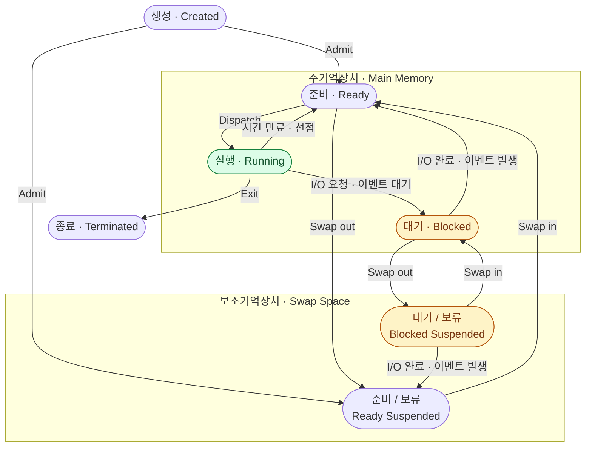

## 0. 운영체제의 기본 요구조건
> 운영체제는 프로세스 관리를 위해 다음 사항을 충족해야 한다.

- **인터리빙 (Interleaving)**
	- 여러 프로세스를 번갈아 수행하여
	- 처리기(CPU) 이용률을 극대화하고 적절한 응답 시간을 제공

- **자원 할당**
	- 교착상태(Deadlock)를 회피하며,
	- 우선순위 등의 특정 정책에 맞게 자원을 할당

- **통신 및 생성 지원**
	- 프로세스 간 통신(IPC)과 사용자 프로세스 생성을 지원하여
	- 응용 프로그램의 구조화를 도움

## 1. 프로세스란?
|        **프로그램**(Program)        |         **프로세스**(Process)          |
| :-----------------------------: | :--------------------------------: |
|         단순한 코드 파일인 프로그램         | 실행 중인 프로그램(a program in execution) |
|                -                |     수행 중인 프로그램의 인스턴스(instance)     |
| 디스크에 저장된 수동적 개체(passive entity) |  처리기에 할당되는 활동의 단위(active entity)   |

> 멀티프로그래밍과 시분할 시스템의 핵심 개념
> 구조적으로 프로그램 코드, 데이터, 스택, 프로세스 정보로 구성

- **프로세스 구성요소(Element)**
	- 식별자, 상태, 우선순위, 프로그램 카운터, 메모리 포인터, 문맥 데이터, I/O 상태 정보, 어카운팅 정보

## 2. 프로세스 상태 (Process States)
### 2.1. 2-state Model

- **수행**(Running)과 **비수행**(Not-running) 두 가지 상태만 존재
	- 비수행 프로세스들은 큐(queue)에서 대기
	
	- *OS는 큐에 있는 PCB 포인터를 관리하며 디스패치(Dispatch)를 수행한다.*

### 2.2. 5-state Model

|     상태      |        설명        |
| :---------: | :--------------: |
|   생성(New)   | 프로세스가 막 만들어진 상태  |
|  준비(Ready)  |   실행 대기 중인 상태    |
| 수행(Running) |  CPU에서 실행 중인 상태  |
| 블록(Blocked) | 이벤트(I/O 등) 대기 상태 |
|  종료(Exit)   |    실행 완료된 상태     |

- **주요 상태 전이**
	- 생성→준비 (승인)
	- 준비→수행 (디스패치)
	- 수행→준비 (시간만료/선점)
	- 수행→블록 (이벤트 대기)
	- 블록→준비 (이벤트 발생)

### 2.3. 스와핑 & 보류(Suspended) 상태
- **스왑-아웃(swap-out)**
	- 메모리 부족 시 프로세스 이미지를 디스크의 스왑 공간으로 내보낸다.
 - **스왑-인(swap-in)**
	 - 다시 메모리로 불러온다.

> 이에 따라 Ready/Suspend, Blocked/Suspend 상태가 추가된다.

- **프로세스 생성 이유**
	- 새로운 일괄처리 작업, 대화형 로그온, OS가 서비스 제공, 기존 프로세스에 의한 생성(spawn)

- **프로세스 종료 이유**
	- 정상 완료, 시간 한도 초과, 메모리 부족, 경계범위 위반, 보호 오류, 산술 오류, 부모 종료 등

### 2.4. 7-state Model
![[7-state_Process_Model.png]]

- *메모*
	- Ready: CPU를 할당받으면 바로 동작 가능한 집합
	- Dispatch: 고르는 작업 - CPU 스케줄링, 디스패처가 작업
	- Blocked Suspended: 준비 안 된 Blocked를 먼저 내려보내는게 유리하다.

## 3. 프로세스 기술 (Process Description)
### 3.1. OS 제어 구조
- OS는 각 프로세스와 자원의 현재 상태를 관리하기 위해 네 종류의 테이블을 유지한다.
	1. **메모리 테이블**: 주기억장치 및 2차 메모리 할당 정보, 가상 메모리 관리 정보
	2. **I/O 테이블**: I/O 장치 할당 및 전송에 필요한 정보
	3. **파일 테이블**: 디스크 내파일 위치, 상태, 속성 정보
	4. **프로세스 테이블**: 프로세스 위치 및 PCB 속성 정보

### 3.2. 프로세스 메모리 레이아웃
[[프로세스 메모리 레이아웃]]

### 3.3. PCB
OS가 관리하는 핵심 자료구조로 다음을 포함한다.
- **프로세스 식별**: PID(자신), PPID(부모), UID(사용자) 등
- **처리기 상태 정보**: 사용자 가시 레지스터, 프로그램 카운터, 조건 코드, 스택 포인터
- **프로세스 제어 정보**: 스케줄링 정보(상태, 우선순위, 이벤트), 프로세스 간 포인터, IPC 정보, 프로세스 권한, 메모리 관리, 자원 이용률

### 3.4. 프로세스 문맥
- *문맥 (Context)*
	- 커널이 관리하는 태스크의 자원과 제어 흐름의 집합

- 프로세스 문맥은 3가지로 구성된다.
	- **시스템 문맥** (task structure, file table 등)
		- *Task Structure → Segment Table → Page Table (불연속적인 메모리의 관리)*
	- **메모리 문맥** (세그먼트/페이지 테이블, 디스크)
	- **하드웨어 문맥** (레지스터: eip, sp, eflags 등)

## 4. 프로세스 제어 (Process Control)
### 4.1. 모드 전환
- 대부분의 처리기는 두 가지 실행 모드를 제공한다.
	- **사용자 모드(User Mode)**: 제한된 권한
	- **커널 모드(Kernel Mode; System)**: 특권 명령 실행 가능

- 모드 전환은 서비스 호출, 인터럽트, I/O 인터럽트 등으로 발생한다. *(+ System Call)*

### 4.2. 프로세스 교환 (문맥 교환)
> 모드 전환은 현재 프로세스의 상태 변경 없이도 발생할 수 있지만,
> 프로세스 교환(문맥 교환)은 반드시 상태 변경을 수반한다.

- **프로세스 교환 유발 사건**
	- 클록 인터럽트: 시간 만료 (수행 → 준비)
	- 메모리 폴트: 페이지 부재 시 디스크에서 읽어옴 (수행 → 블록)
	- I/O 인터럽트: 입출력 완료 (블록 → 준비)
	- 트랩: 오류나 예외 상황 발생
	- 수퍼바이저 호출: 시스템 콜(OS 서비스) 요청 발생

- **프로세스 교환/문맥 교환** (Process Switching/Context Switching)
	- 현재 실행 중인 프로세스의 문맥(레지스터, 상태 등)을 PCB에 저장하고,
	- 새로운 프로세스의 문맥을 복원하여 CPU의 제어권을 완전히 넘기는 작업
	- *(+ 오버헤드 발생)*

- **프로세스 교환 절차**
	1. 현재 프로세스(PA)의 처리기 문맥 저장
	2. PA의 PCB 갱신
	3. PA의 PCB를 적절한 큐에 삽입
	4. 실행할 프로세스(PB) 선택
	5. PB의 PCB 갱신
	6. 메모리 관리 자료구조 갱신
	7. PB의 문맥 복원(restore)

### 4.3. 프로세스 생성 절차
- 유일한 PID 할당
- → 주소공간 할당
- → PCB 초기화(PC, SP, 우선순위 등)
- → 준비큐에 삽입
- → 관련 자료구조 생성

## 5. 운영체제의 실행 방식
> OS가 실행되는 방식은 세 가지이다.

- **(a) 분리된 커널**
	- OS 코드가 특권 모드에서 독립된 개체로 실행

- **(b) 사용자 프로세스 내 실행**
	- 각 프로세스의 주소 공간 안에 OS 기능이 포함되어,
	- OS 코드 실행 시 커널 모드로 전환

- **(c) 프로세스 기반 OS**
	- OS 자체가 시스템 프로세스들의 집합으로 구현되며,
	- 다중 처리기 환경에 유용

## cf. UNIX SVR4 프로세스 관리
> *오래된 것이긴 하지만 참고*

- UNIX SVR4는 **OS가 사용자 프로세스 환경 내에서 실행**되는 모델을 사용하며, **9개의 프로세스 상태**를 정의한다.
	- 사용자 수행, 커널 수행, 메모리 상의 준비, 스왑된 준비, 메모리 상의 수면, 스왑된 수면, 선점, 생성, 좀비

- **주요 프로세스**
	- **pid 0**: swapper (스와퍼 프로세스)
	- **pid 1**: init (초기화 프로세스)

- **프로세스 이미지 구성**
	- 사용자 수준 문맥 (텍스트, 데이터, 사용자 스택, 공유 메모리)
	- 레지스터 문맥 (PC, 처리기 상태 레지스터, 스택 포인터)
	- 시스템 수준 문맥 (프로세스 테이블 항목, U area, 커널 스택)

- 프로세스 생성 - **fork() 동작 순서**
	- 프로세스 테이블 슬롯 할당
	- → PID 할당
	- → 부모 이미지 복사
	- → 파일 참조계수 증가
	- → 자식을 준비 상태로 설정
	- → 부모에게 자식 PID 반환, 자식에게 0 반환
