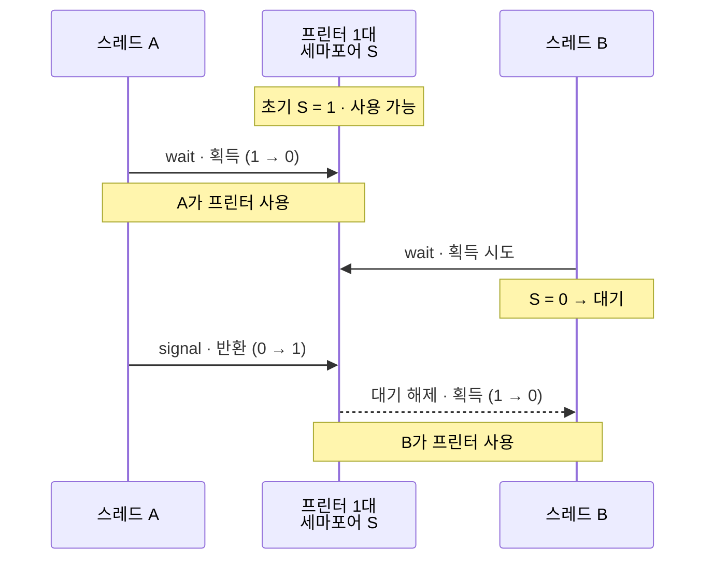
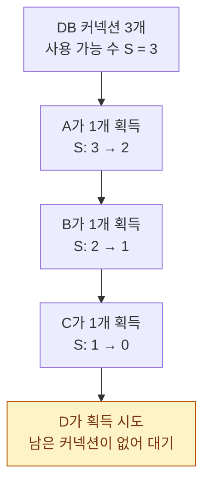

## 1. 병행성 원리 (Principles of Concurrency)
- **멀티프로세스 환경**은 현대 운영체제의 핵심 설계 주제로,
	- Multiprogramming(단일 처리기 인터리빙), Multiprocessing(다중 처리기 인터리빙+오버래핑), Distributed Processing 형태가 있다.
	- 이들 모두 공통적으로 **병행성(Concurrency)** 문제, 즉 여러 프로세스의 상호작용을 어떻게 관리할 것인가의 문제를 발생시킨다.

### 1.1. 병행 처리
> ==병행 처리의 개념, 문제점, 해결법 기말고사 출제==

- **순차 처리**(Serial Processing); *직렬 프로그래밍(Serial Programming)*
	- CPU가 여러 작업을 **한 번에 하나씩 순서대로 실행**하는 방식
	- $P_1, P_2, P_3$

- **병행 처리**(Concurrent Processing); *동시 프로그래밍(Concurrent Programming)*
	- CPU가 여러 작업을 ==번갈아가며 실행하거나, 실제로 동시에 실행==한다.
	
	1. **인터리빙 방식**(Interleaving)
		- 1개의 CPU에서 번갈아가면서 실행 (멀티 프로그래밍)
			- $P_{11}, P_{21}, P_{31}, P_{12}, P_{22}, P_{32}, P_{13}, P_{23}, P_{33}$
	2. **오버래핑 방식**(Overlapping) / **병렬 처리**(Parallel Processing); 병렬 프로그래밍
		- 여러개의 CPU에서 병렬적으로 실행
			- $\text{CPU}_1: P_1$
			- $\text{CPU}_2: P_2$
			- $\text{CPU}_3: P_3$
		- 각 CPU에서 인터리빙 방식도 가능

- *Parallel은 Concurrent의 Subset*
	- -> 해결하는 방법이 같기 때문

- ==병행 처리의 문제점==으로는
	- ==전역 자원의 공유가 어렵다. (경쟁 상태)==
	- 운영체제가 자원을 최적으로 할당하기 어렵다.
	- 프로그래밍 오류를 찾아내기 어렵다.

> 이러한 문제는 단일처리기 시스템과 다중처리기 시스템 모두에서 동일하게 발생하는데,
> 단일처리기에서도 프로세스 수행의 상대적인 속도가
> 다른 프로세스의 행동, OS의 스케줄링 정책, 인터럽트 처리 방식에 따라 달라지기 때문이다.

### 1.2. 경쟁 상태
> 공유 자원: 공유 변수, IPC 기법의 공유 메모리, file
> 공유 자원을 동시에 접근할 때 **경쟁 상태(Race Condition)** 발생

- **경쟁 상태(Race Condition)** 는
	- 다중 프로세스/스레드가 데이터를 읽거나 갱신하려 할 때 발생하며,
	- 최종 결과가 수행 순서에 의해 결정된다.
	- 가장 마지막으로 데이터를 수정한 프로세스(경쟁의 패자)가 결국 최종 결과를 결정하게 된다.

#### (1) 문제 상황 정의
```c
// 경쟁 상태의 예: 공유 변수 x에 두 연산이 동시에 접근할 때

// t1
x = x + 10;

LOAD   X, R1
ADD   R1, 10
STORE R1,  X

// t2
x = x - 10;

LOAD   X, R2
SUB   R2, 10
STORE R2,  X
```
> 위와 같이 서로 관련있는 코드의 영역을 임계 영역(**Critical Section**)이라고 부른다.
> 이를 실행할 때는 ==시리얼하게(순차적으로)== 실행해야 한다.

```c
// 해결 방법의 추상적 정의

// t1
lock(a);
x = x + 10;
unlock(a);

LOAD   X, R1
ADD   R1, 10
STORE R1,  X

// t2
lock(a); // -> thread1이 먼저 lock을 걸면, 진입하지 못하고 block 상태가 된다.
x = x - 10;
unlock(a);

LOAD   X, R2
SUB   R2, 10
STORE R2,  X
```

```c
// t3이 추가된 문제

// t1
lock(b);
y = y + 10;
unloack(b);

// t3
lock(b);
y = y - 10;
unlock(b);
```

### 1.3. 해결법
```
<iframe src="https://ken-jeong.github.io/pages/mutex_semaphore.html" width="100%" height="700"></iframe>
```

- 병행 처리의 문제점을 ==해결하는 대표적인 방법==
	- -> 공유 변수에 동시에 접근하지 못하게 한다.
	- -> 들어가기 전 lock을 걸고, 빠져나오면서 unlock을 한다.

- 어떻게 프로그래밍하나?
	1. 공유 자원을 접근하는 코드 영역(Critical Section)을 분류한다.
	2. 적절한 Locking Mechanism을 사용한다.

#### (1) Locking Mechanism
1. ==Mutually Exclusive Lock==
	- **상호 배제**를 위한 lock 방식, 한 번에 **하나의 스레드만 접근 가능**
	- pthread_mutex_lock();
	- ptherad_mutex_unlock();

2. ==Semaphore Lock==
	- 여러 프로세스의 접근을 제어하는 **카운팅 기반 동기화 기법**
	- Synchronization을 위해 사용
	1. 이진 세마포어(Binary Semaphore)
	2. 카운팅 세마포어(Counting Semaphore)

3. ==Reader/Writer Lock==

4. Java Monitor Lock

### 1.4. 운영체제 고려사항
- 운영체제는 이를 위해 다음 네 가지 사항을 고려해야 한다.
	1. 프로세스 행위 추적
	2. 자원 할당/반납 관리
	3. 프로세스 간 간섭으로부터 *자원/데이터를* 보호
	4. 수행 순서와 무관한 결과 보장

## 2. 상호배제 (Mutual Exclusion)
- **상호배제 요구조건**은 다음과 같다:
	- 어느 한 순간에는 오직 *하나의 프로세스만 임계영역(critical section)에 진입* 가능
	- 임계영역 밖에서 멈춘 프로세스가 *다른 프로세스의 수행을 간섭하지 않아야 함*
	- 교착상태(deadlock)와 기아(starvation)가 발생하지 않아야 함
		- 임계영역이 비어 있을 때 진입하려는 프로세스가 지연되지 않아야 함
		- 프로세스는 유한 시간 동안만 임계영역에 존재해야 함
	- 프로세서 개수나 수행 속도에 대한 가정이 없어야 함

- 구현 방법은
	- 소프트웨어적 접근(부하 높고 오류 위험 큼),
	- 하드웨어 지원,
	- 세마포어,
	- 모니터,
	- 메시지 전달 등으로 나뉜다.

- **하드웨어 지원** 방법은 두 가지이다.
	- **인터럽트 금지**는 단일 프로세서에서만 효과적이며 다중 프로세서에서는 한계가 있다.
	- **특별한 기계 명령어**로는
		- `compare_and_swap`(값을 비교하여 일치하면 새 값으로 교체)과
		- `exchange`(레지스터와 메모리 값 교환)가 있으며,
		- 이들은 **원자적 연산(atomic operation)** 으로 수행된다.

- 하드웨어 명령어의
	- 장점은 임의 개수 프로세스에 적용 가능하고 다중 임계영역을 지원한다는 점이며,
	- 단점은 **바쁜 대기(busy-waiting)**, 기아상태, 교착상태 발생 가능성이다.
		- (예: 우선순위가 낮은 프로세스가 임계영역을 점유한 상태에서 우선순위 높은 프로세스가 바쁜 대기 시 교착 발생)

## 3. 세마포어 (Semaphore)
- **세마포어**는
	- 상호배제를 운영체제/프로그래밍 언어 수준에서 지원하는 메커니즘으로,
	- 블록(수면)과 깨움을 지원한다.

### 3.1. 세마포어의 연산
- 세마포어는 정수 값을 갖는 변수로 세 가지 연산을 통해 접근한다:
	1. **초기화 연산**: 음이 아닌 값으로 초기화
	2. **대기 연산(semWait, P)**: 값을 감소시키고, 음수가 되면 호출 프로세스를 블록
	3. **시그널 연산(semSignal, V)**: 값을 증가시키고, 양수가 아니면 블록된 프로세스를 깨움

### 3.2. 세마포어의 종류
- 종류로는
	1. 0 또는 1만 갖는 **이진 세마포어(mutex)** 와
	2. 정수 값을 갖는 **일반(카운팅) 세마포어**가 있다.

#### (1) 이진 세마포어

- 한 번에 **하나만 접근 가능**
- 락(lock)처럼 사용됨

#### (2) 카운팅 세마포어

- 동시에 **N개까지 접근 가능**
- 자원 개수 제한 관리에 적합

#### (3) 세마포어 상호배제 예제
```c
const int n = /* 프로세스 개수 */;
semaphore s = 1;

void P(int i) {
	while (true) {
		semWait(s);
		/* 임계영역 */
		semSignal(s);
		/* 임계영역 이후 코드 */
	}
}

void main() {
	parbegin(P(1), P(2), ..., P(n));
}
```

### 3.3. 생산자/소비자 문제
- **생산자/소비자 문제**는 세마포어의 대표적 응용 예이다.

- **세마포어 구현**에서
	- `semWait`와 `semSignal`은 반드시 원자적으로 구현되어야 하며,
	- compare_and_swap 명령어 사용이나 인터럽트 금지 등의 방법으로 구현할 수 있다.

#### (1) 무한 버퍼
- 이진 세마포어만 사용하는 부정확한 버전도 있으며, 이는 지역 변수 `m`을 도입해 정확한 버전으로 수정할 수 있다.

```c
semaphore n = 0; // 순서 제어
semaphore s = 1; // 상호배제용

void producer() {
	while (true) {
		produce();
		semWait(s);
		append();
		semSignal(s);
		semSignal(n);
	}
}

void consumer() {
	while (true) {
		semWait(n);
		semWait(s);
		take();
		semSignal(s);
		consume();
	}
}

void main() {
	parbegin(producer, consumer);
}
```

#### (2) 유한 버퍼
> ==유한 버퍼 문제 확인==
```c
const int sizeofbuffer = /* buffer size */;

// 범용 세마포어 3개를 사용해 깔끔하게 해결할 수 있다.
semaphore e = sizeofbuffer; // 빈 공간 수
semaphore s = 1;            // 상호배제용
semaphore n = 0;            // 순서 제어

void producer() {
	while (true) {
		produce();
		semWait(e); // +
		semWait(s);
		append();
		semSignal(s);
		semSignal(n);
	}
}

void consumer() {
	while (true) {
		semWait(n);
		semWait(s);
		take();
		semSignal(s);
		semSignal(e); // +
		consume();
	}
}

void main() {
	parbegin(producer, consumer);
}
```

#### (3) 메모
- **생산자/소비자 문제**(Producer–Consumer Problem)는
	- 동시성 프로그래밍의 고전적인 동기화 문제이다.

- 핵심 개념
	- 생산자(Producer): 데이터를 만들어 공유 버퍼(buffer)에 넣는 스레드/프로세스
	- 소비자(Consumer): 공유 버퍼에서 데이터를 꺼내 처리하는 스레드/프로세스
	- 공유 버퍼: 생산자와 소비자가 함께 사용하는 저장 공간 (예: 큐)

- 문제가 발생하는 이유
	- 생산자와 소비자가 동시에 같은 버퍼에 접근하기 때문이다.

- 대표 문제 3가지:
	1. 경쟁 상태 (Race Condition)
		- 생산자와 소비자가 동시에 버퍼를 수정하면 데이터가 꼬일 수 있다.
	2. 버퍼 언더플로우
		- 버퍼가 비어 있는데 소비자가 꺼내려는 경우
	3. 버퍼 오버플로우
		- 버퍼가 가득 찼는데 생산자가 계속 넣으려는 경우
		- *무한 버퍼 가정에서는 사라지는 문제*

- 해결 방법
	- 동기화 기법을 사용한다.
	1. Mutex (상호 배제)
		- 한 번에 하나의 스레드만 버퍼 접근 가능하게 함
	2. Semaphore
		- 자원 개수를 관리하는 카운터 기반 동기화 도구

- 요약
	- 공유 버퍼를 생산자와 소비자가 안전하게 주고받도록 동기화하는 문제

- 실무 대응
	- Blocking Queue (Java)
	- Channel (Go)
	- asyncio.Queue (Python)
	- Message Queue (RabbitMQ, Kafka 등)
	- 실무에서는 직접 세마포어를 구현하기보다 이런 고수준 추상화를 더 많이 사용한다.

## 4. 모니터 (Monitor)
<iframe src="https://ken-jeong.github.io/pages/monitor_message_passing.html" width="100%" height="700"></iframe>

- **모니터**는
	- 상호배제를 위한 소프트웨어 모듈로
	- 프로그래밍 언어 수준(Concurrent-Pascal, Java 등)에서 제공된다.
	- 세마포어와 동일한 기능을 제공하지만 사용이 훨씬 쉽다.

- 특징
	- 지역 변수는 모니터 내부에서만 접근 가능
	- 프로시저 호출을 통해서만 모니터에 진입
	- 한 시점에 오직 하나의 프로세스만 모니터 내부에서 수행

- 구조는
	- 프로시저들, 지역변수, 조건변수로 구성되며,
	- **조건 변수(condition variable)** 를 통해 동기화를 수행한다.
	
	- `cwait(c)`는 조건 c에서 호출 프로세스를 일시 중지시키고,
	- `csignal(c)`는 중지된 프로세스를 재개시킨다.

- 생산자/소비자 문제는
	- `notfull`과 `notempty` 두 조건변수로 우아하게 해결된다.

- **Mesa 모니터**는
	- `cwait` 대신 `while`문과 `cnotify`를 사용하는 변형 방식이다.

## 5. 메시지 전달 (Message Passing)
> 패스

- 기본 인터페이스는
	- `send(destination, message)`와 `receive(source, message)`로,
	- 정보 교환뿐 아니라 상호배제와 동기화에도 사용 가능하다.

- 주요 설계 특성
	- **동기화**: 송신/수신에서 블로킹 또는 비블로킹
	- **주소 지정**: 직접(명시적/암묵적) 또는 간접(메일박스/포트 사용)
	- **메시지 포맷**: 고정 또는 가변 길이
	- **큐잉 방식**: FIFO 또는 우선순위

- 통신 구조는
	- 일대일, 다대일(포트), 일대다, 다대다 형태가 있다.
	- 수신자는 송신 전에 메시지를 받을 수 없다는 **암묵적 동기화**가 포함되어 있다.

- 메시지 전달을 이용한 상호배제는
	- 메일박스에 토큰 역할을 하는 메시지 하나를 두어 구현하며,

- 생산자/소비자 문제는
	- `mayproduce`/`mayconsume` 두 메일박스로 해결한다.

## 6. 판독자/기록자 (Readers/Writers) 문제
- **문제 정의**
	- 병행 수행되는 판독자와 기록자가 공유 자원(파일, DB)에 접근한다.

- **요구 조건**
	- 여러 판독자는 동시에 읽기 가능
	- 한 시점에 오직 하나의 기록자만 변경 가능
	- 기록자가 변경 중일 때 판독자는 읽을 수 없음

- 메모
	- Read 하는데 Read 할 때만 문제가 없음

- 생산자/소비자 문제와 달리,
	- **여러 판독자의 동시 접근을 허용**한다는 점이 핵심 차이이다.

### 6.1. 해결 방법
- **판독자 우선**(세마포어)
	- `readcount`와 두 세마포어(`x`, `wsem`)를 사용
	- 판독자가 많으면 기록자가 무한히 기다릴 수 있어 **기록자 기아** 가능

- **기록자 우선**(세마포어)
	- 추가 변수(`writecount`)와 세마포어(`y`, `z`, `rsem`)를 사용해 기록자가 대기 중이면 새 판독자를 차단

- **메시지 전달**
	- 컨트롤러 프로세스가 `readrequest`, `writerequest`, `finished` 메일박스를 통해 판독자와 기록자 요청을 조율

## 7. 정리: 병행성 원리
- **프로세스 상호작용**은 인식 정도에 따라
	1. 경쟁 (서로 인식 못함 → 상호배제, 교착, 기아 문제),
	2. 공유를 통한 협력 (간접 인식 → 데이터 일관성 추가),
	3. 통신을 통한 협력 (직접 인식 → 교착, 기아 문제)으로 나뉜다.

- **주요 용어**
	- 원자적 연산 (분할 불가, 중간 상태 관찰 불가),
	- 임계영역 (공유 자원 접근 코드),
	- 교착상태 (상호 대기로 진행 불가),
	- 라이브락 (상태 변화만 반복),
	- 상호배제 (임계영역 단독 수행),
	- 경쟁상태 (수행 순서에 따라 결과 변화),
	- 기아 (스케줄링 누락)

- **대표적 병행성 기법**
	- 세마포어 (카운팅/일반),
	- 이진 세마포어,
	- 뮤텍스 (획득자가 반드시 해제),
	- 조건변수,
	- 모니터 (추상 데이터 유형으로 캡슐화),
	- 이벤트 플래그(AND/OR 대기),
	- 메일박스/메시지,
	- 스핀락 (바쁜 대기 기반 락)
