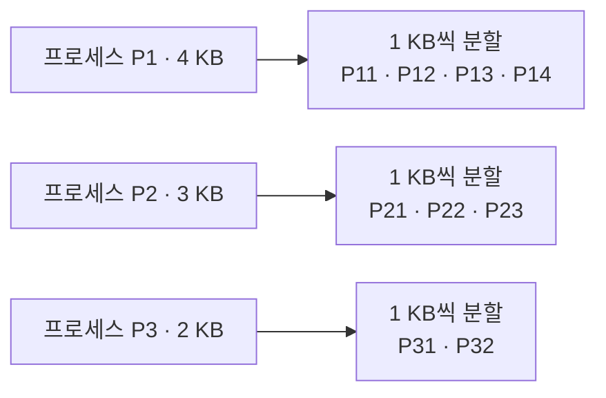
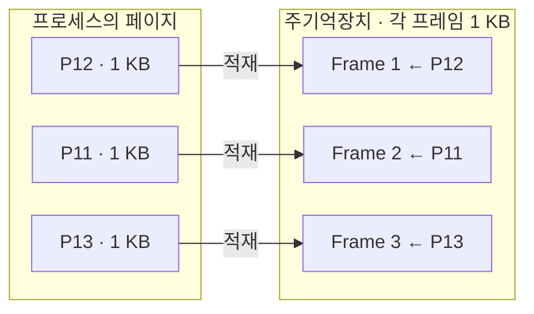
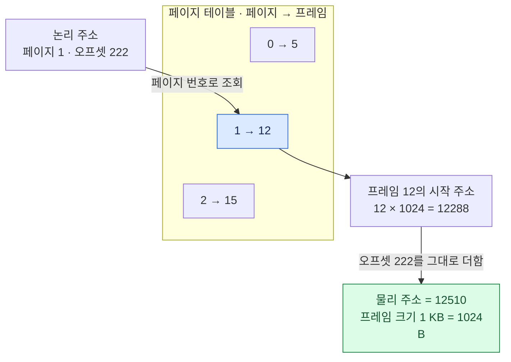
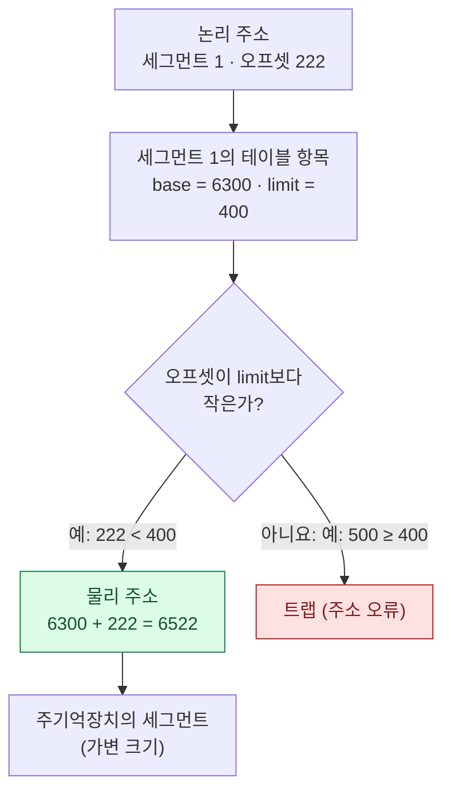

## 1. 메모리 관리 요구조건
- **메모리 관리란?**
	- 다중 프로그래밍 시스템에서
	- 다수의 프로세스를 수용하기 위해
	- 주기억장치를 동적으로 분할하는 작업이다.

### 1.1. 주요 요구 조건 5가지
1. **재배치**(Relocation)는
	- 프로세스가 스왑인/스왑아웃되면서 다른 주소 공간으로 옮겨갈 수 있어야 한다는 것이다.

2. **보호**(Protection)는
	- 다른 프로세스의 간섭으로부터 자신의 메모리 공간을 지키는 것으로
	- 하드웨어적 검사가 필요하다.

3. **공유**(Sharing)는
	- 보호 기능을 침해하지 않는 범위에서 여러 프로세스가 같은 메모리 영역에 접근할 수 있게 하는 것이다.

4. **논리적 구성**은
	- 모듈 단위 처리를 통해 독립적 컴파일, 모듈별 보호 등급 적용, 프로세스 간 공유를 가능하게 하며
	- 대표 기술이 세그먼테이션이다.

5. **물리적 구성**은
	- 주기억장치와 보조기억장치 사이의 정보 흐름을 시스템이 책임지는 것으로,
	- 주기억장치 용량이 부족할 때 오버레이 기법을 사용한다.

## 2. 메모리 관리
> *운영체제가 메인 메모리를 관리하는 방식*
> 메모리 관리(Memory Management) 기법은 크게 두 가지로 나뉜다.

|  메모리 분할 \ 프로그램 공간   |                       연속 메모리 관리                        |                     불연속 메모리 관리                     |           불연속 + 가상 메모리           |
| :-----------------: | :----------------------------------------------------: | :------------------------------------------------: | :------------------------------: |
| 고정 크기<br>(메모리 분할 O) |  **고정 분할** (Fixed Partitioning)<br>내부 단편화 O, 외부 단편화 X  |     단순 **페이징** (Paging)<br>내부 단편화 적게, 외부 단편화 X     |  *가상 메모리 페이징*<br>전체를 로드할 필요 없음   |
| 가변 크기<br>(메모리 분할 X) | **동적 분할** (Dynamic Partitioning)<br>내부 단편화 X, 외부 단편화 O | 단순 **세그먼테이션** (Segmentation)<br>내부 단편화 X, 외부 단편화 O | *가상 메모리 세그먼테이션*<br>전체를 로드할 필요 없음 |
|         절충안         |               **버디 시스템** (Buddy System)                |                         -                          |                -                 |

### 2.1. 연속 메모리 관리
- **연속 메모리 관리** (Continuous Memory Management)
	- 프로그램 전체가 하나의 큰 공간에 연속적으로 할당되어야 한다.
	- 단일 연속 관리, 고정 분할, 동적 분할이 있다.

```
[ Main Memory ]
P1(4k) -> 10000번지에 올라갔을 때, 10000부터 10000+4k까지 할당
P2(3k) -> 20000번지에 올라갔을 때, 20000부터 20000+3k까지 할당
P3(2k) -> 30000번지에 올라갔을 때, 30000부터 30000+2k까지 할당
```

### 2.2. 불연속 메모리 관리
- **불연속 메모리 관리** (Non-continuous Memory Management)
	- 프로그램의 일부가 서로 다른 주소 공간에 할당될 수 있다.
	- 고정 크기인 페이징과 가변 크기인 세그먼테이션이 있다.


> 각 조각은 Continuous한 할당 단위, 조각 간에는 Non-continuous

## 3. 연속 메모리 관리의 메모리 분할
### 3.1. 고정 분할
- **고정 분할** (Fixed Partitioning)
	- 시스템 생성 시점에 **고정된 경계로 메모리를 나누는(Partitioning) 방식**이다.
	- **균등 분할**과 **비균등 분할**이 있다.

- **장점**
	- 구현이 간단하다.
	- 운영체제 오버헤드가 거의 없다.

- **단점**
	- **내부 단편화**(파티션 내부에 사용되지 않는 공간)가 발생한다.
	- 활성화된 **프로세스 수**가 파티션 수로 **제한**된다.

- 배치 방식으로는
	- 파티션마다 큐를 두는 방식과
	- 단일 큐 방식이 있다.

### 3.2. 동적 분할
- **동적 분할** (Dynamic Partitioning)
	- 파티션 크기와 개수가 가변적이며, **프로세스가 요구한 크기만큼만 할당**한다.

- **장점**
	- 내부 단편화가 없다.

- **단점**
	- **외부 단편화**(파티션들 사이에 작은 빈 공간이 흩어짐)가 발생하므로,
	- 이를 해결하기 위한 **메모리 집약**(compaction)이 필요해 처리기 효율이 떨어진다.

- 배치 알고리즘 네 가지
	1. **최적적합(best-fit)**
	2. **최초적합(first-fit)**
	3. **순환적합(next-fit)**
	4. **최악적합(worst-fit)**

### 3.3. 버디 시스템
> ==버디 시스템 그림==


- **버디 시스템** (Buddy System)
	- 고정 분할과 동적 분할의 절충안이다.
	- 메모리 블록 크기를 $2^K\quad(L≤K≤U)$로 관리한다.
	- **요청이 들어오면**: 적절한 크기의 블록을 둘로 나누어 할당하고,
	- **반환 시**: 인접한 짝(buddy)이 비어있으면 합친다.
	- 트리 구조로 표현 가능하다.
	- 병렬 시스템에서 활용된다.

### 3.4. 재배치를 위한 주소 유형
- **논리 주소**: 현재 메모리 할당과 무관한 주소
- **상대 주소**: 알려진 지점(보통 베이스 레지스터)에 대한 상대적 위치
- **물리 주소**: 실제 주기억장치의 절대 주소

- 베이스 레지스터와 경계 레지스터를 사용해 상대 주소를 절대 주소로 변환하고 메모리 보호를 수행한다.

## 4. 불연속 메모리 관리의 메모리 분할
- cf. 8장
	- **단순-(Simple-)**: 메인 메모리에 모든 조각이 올라가야 한다.
	- **가상-(Virtual-)**: 일부만 올라가도 실행이 가능하다.

### 4.1. 페이징
- **페이징** (Paging)
	1. 프로세스를 **페이지라는 작은 고정 크기 조각으로 나누고**, (불연속 메모리 관리)
	2. 주기억장치를 같은 크기의 **프레임**으로 나눈 뒤, (고정 크기 메모리 분할)
	3. **페이지 테이블**을 통해 각 페이지가 어느 프레임에 있는지 관리한다.



- **특징**
	- 외부 단편화가 발생하지 않는다.
	- 프로세스의 페이지들이 메모리상에서 연속적일 필요가 없다.
	- 내부 단편화는 각 프로세스의 마지막 페이지에서만 소량 발생한다.

- **주소 변환**은
	- 논리주소 `<페이지 번호, 오프셋>`을
	- 페이지 테이블에서 찾은 프레임 번호와 결합해 물리주소를 만든다.

- ==주소 바인딩==



### 4.2. 세그먼테이션
- **세그먼테이션** (Segmentation)
	- (가변 크기 메모리 분할)
	- 프로그램을 의미 있는 단위(서브루틴, 스택, 심볼 테이블, 메인 프로그램 등)인 **세그먼트**로 나누는 방식이다.
		- **세그먼트는 비균등 크기**를 가진다. (불연속 메모리 관리)
	- 동적 분할과 유사하지만, 하나의 프로세스가 비연속적인 여러 파티션을 차지할 수 있다는 점이 다르다.

```
[ Main Memory ]
P12(가변크기)
P11(가변크기)
P13(가변크기)
```



| seg_num | base | limit |
| --- | --- | --- |
| 0 | 1400 | 1000 |
| 1 | 6300 | 400 |
| 2 | 4300 | 500 |

페이징과 달리 기준 주소에 오프셋을 더하기 전에 **경계 검사**를 먼저 한다.

- **세그먼트 테이블**은
	- 각 세그먼트의 **시작 주소**(base)와 **길이**(limit)를 관리한다.
	- 논리주소는 `<세그먼트 번호, 오프셋>` 형태이며,
	- 시작 주소에 오프셋을 더해 물리주소를 얻는다.

- **특징**
	- 내부 단편화가 없고 모듈별 보호와 공유에 유리하다.
	- 외부 단편화 문제가 남아있다.

## 부록: 로딩과 링킹
- **로더**는
	- 프로그램을 모듈 단위로 주기억장치에 적재하는 역할을 한다.

- **링커**는
	- 모듈 간 상호 참조가 가능하도록 연결하는 역할을 한다.

- **주소 바인딩 시점**에 따라 구분하면,
	- 프로그래밍 시점(프로그래머가 직접 명시),
	- 컴파일/어셈블리 시점(컴파일러가 변환),
	- 적재 시점(로더가 절대 주소로 변환),
	- 실행 시점(처리기 하드웨어가 동적 변환)이 있다.

- **로딩 방식**은
	- 절대 로딩, 재배치 가능 로딩, 동적 실행시간 로딩으로 나뉘며,

- **링킹**은
	- 정적 라이브러리를 사용하는 정적 링킹과
	- 실행 시점에 연결하는 동적 링킹으로 나눌 수 있다.
