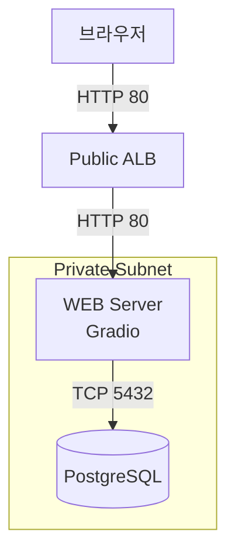
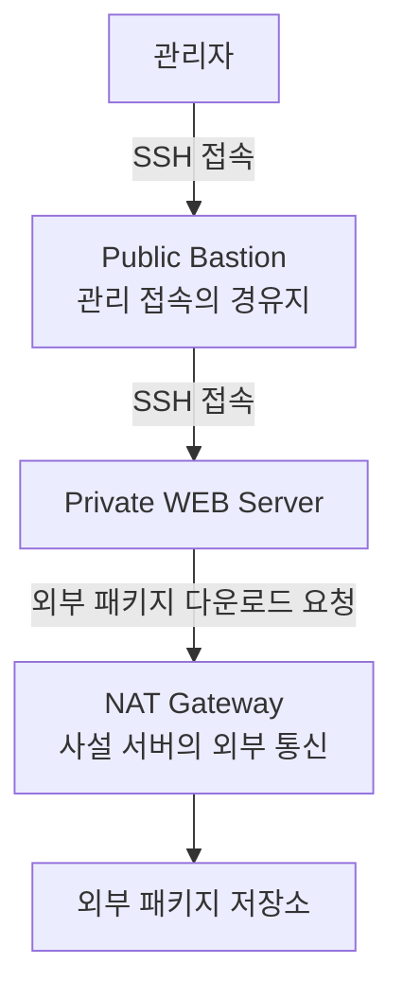

## 1. 이론
### 1.1. DBMS 스펙 비교표
|     구분     | 기본 스토리지 | 추가 스토리지 |  최대 용량  | 읽기 부하 분산(Replica) | 백업 보관 | Port |
| :--------: | :-----: | :-----: | :-----: | :---------------: | :---: | :--: |
|   MySQL    |  10GB   | 10GB 단위 | 6,000GB |      최대 10개       |  30일  | 3306 |
|   MSSQL    |  100GB  | 10GB 단위 | 2,000GB |       최대 5개       |  30일  |  -   |
| PostgreSQL |  10GB   | 10GB 단위 | 6,000GB |       최대 5개       |  30일  | 5432 |
|  MongoDB   |  50GB   | 10GB 단위 | 2,000GB |         -         |   -   |  -   |
|   Redis    |    -    |    -    |    -    |      최대 10개       |  7일   | 6379 |

### 1.2. DBMS별 상세 특징
#### (1) MySQL
- **정의**: 오픈소스 관계형 데이터베이스 관리 시스템(RDBMS)

- **주요 기능**
	- **Failover (장애 조치)**: 마스터 DB 장애 시에도 안정적인 서비스 제공
	- **읽기 부하 분산**: 마스터 서버 1개당 슬레이브 서버 **최대 10개** 생성 가능
	- **멀티 존 구성**: 액티브(Active)와 스탠바이(Standby) 마스터 DB를 서로 다른 존(Zone)에 구축하여 가용성 확보
	- **자동 백업**: 지정된 시간에 DB 자동 백업 수행

#### (2) Microsoft SQL Server (MSSQL)
- **정의**: 상용 관계형 데이터베이스 관리 시스템

- **주요 기능**
	- **Failover**: 주 DB 장애 발생 시 미러(Mirror) DB로 자동 대체
	- **읽기 부하 분산**: 읽기 전용 슬레이브 서버 **최대 5개** 생성 가능
	- **멀티 존 구성**: 액티브와 스탠바이 마스터 DB를 서로 다른 존에 구축

#### (3) PostgreSQL
- **정의**: 객체-관계형 데이터베이스 관리 시스템(ORDBMS)

- **ACID 특성 (트랜잭션의 4가지 성질)**
	1. **원자성**(Atomicity): 트랜잭션 내 모든 작업은 모두 수행되거나, 아예 수행되지 않아야 함 (All or Nothing)
	2. **일관성**(Consistency): 트랜잭션 수행 전후에 DB는 항상 정합성 있는 상태를 유지해야 함
	3. **고립성**(Isolation): 여러 트랜잭션이 동시에 실행되어도 서로 독립적으로 실행되는 것처럼 보장함
	4. **지속성**(Durability): 성공적으로 완료된 트랜잭션의 결과는 영구적으로 반영되어야 함

- **주요 기능**
	- **Failover**: Primary DB 장애 시 Secondary DB로 자동 대체
	- **읽기 부하 분산**: 개별 Primary DB당 Read Replica **최대 5대** 생성 가능

#### (4) MongoDB
- **정의**: 문서 지향(Document-Oriented) 데이터베이스 (NoSQL)

- **주요 기능**
	- **샤드 클러스터**(Shard Cluster): 데이터를 여러 서버에 분산 저장하여 대용량 데이터를 효율적으로 관리
	- **레플리카 세트**(Replica Set): 동일한 데이터 세트를 유지하는 Mongod 프로세스 그룹 (데이터 복제)
	- **Compass**: MongoDB가 공식 제공하는 GUI 관리 도구

#### (5) Redis
- **정의**: 인메모리(In-Memory) 데이터 저장소

- **주요 기능**
	- **오토 샤딩**(Auto Sharding): 데이터를 여러 서버에 자동으로 분산 저장
	- **Failover**: 마스터 노드 장애 감지 시 슬레이브 노드가 마스터로 자동 전환

## 2. 전체 시스템 아키텍처
**사용자 요청 경로**: 공용 진입점인 ALB를 통해 사설망의 WEB 서버에 접근한다.

**운영 경로**: 관리자 접속과 서버의 외부 다운로드는 목적이 다르다. 아래는 각 연결을 시작하는 방향이다.

Bastion은 관리자가 서버에 들어가는 경유지, NAT Gateway는 서버가 외부에 요청을 보내는 경유지다.

- **WEB Server**
	- Rocky Linux 8.10 기반
	- Gradio App(Python) 실행 (UI 렌더링, 포트 80)

- **DB**
	- 사용자 정보 및 게시글 저장을 위한 PostgreSQL

## 3. 사전 준비 및 네트워크 설정
보안을 위해 WEB 서버를 **Private Subnet**에 배치하므로, 외부 통신(패키지 설치 등)을 위한 설정이 필요하다.

1. **NAT Gateway Subnet 생성**
	- 이름: `xxx-kr1-pub-ngt-sub`
	- IP 범위: `10.xxx.254.0/24`
	- 용도: NAT Gateway 전용

2. **NAT Gateway 생성**: VPC 내에서 생성

3. **Route Table 설정**
	- Private Subnet의 Route Table 선택
	- 목적지(Destination) `0.0.0.0/0` (모든 트래픽)의 타겟을 **NAT Gateway**로 설정
	- *이유: 사설망 서버가 외부 저장소(Repo)에서 패키지를 다운로드하기 위함*

## 4. 리소스 생성 (WEB & DB)
### 4.1. WEB Server 생성
- **위치**: **Private Subnet** (공인 IP 할당 안 함)
- **보안**: ALB 뒤에 숨겨 보안성을 높임
- **접속 방법**: 외부에서 직접 접속 불가하므로, 1일차에 만든 Public Server(Bastion Host)를 통해 SSH로 우회 접속 (`ssh root@사설IP`)

### 4.2. Cloud DB for PostgreSQL 생성
- **설정**
	- VPC: Private Subnet 선택
	- Type: Standard (vCPU 2, 8GB), **Version 13.7** (실습 호환성 위함)
	- DB 이름 및 User ID: 학번 등 식별 가능한 이름 사용

- **ACG (보안 그룹) 설정**
	- Inbound 규칙에 **TCP 5432** 포트 오픈
	- 접근 소스: VPC 전체 대역 (`10.xxx.0.0/16`) 허용

## 5. ALB(Application Load Balancer) 연동
웹 서버가 사설망에 있으므로, 외부 접속을 위해 로드밸런서를 연결한다.

1. **Target Group 생성**
	- 프로토콜: HTTP, 포트: 80
	- Target 유형: VPC Server (생성한 Private WEB Server 추가)
	- Health Check: 포트 80

2. **Load Balancer 생성**
	- 네트워크: **Public**
	- Listener: HTTP 80
	- 앞서 생성한 Target Group 연결
	- *결과: ALB의 공인 DNS 주소를 통해 사설망의 웹 서버로 접속 가능*

## 6. WEB Server 환경 구성 (SSH 접속 후 진행)
### 6.1. OS 및 패키지 설치
- **OS 준비**: `sudo dnf update`, Development Tools 설치
- **Python 설치**: 소스 컴파일 방식으로 **Python 3.8.18** 설치
- **라이브러리 설치**: `pip3 install gradio psycopg2-binary` (웹 UI 및 DB 연동용)

### 6.2. PostgreSQL DB 설정
- **접속**: Private 도메인을 이용해 `psql` 명령어로 접속
- **스키마 및 테이블 생성**
	- RDS는 슈퍼유저(root) 권한을 주지 않으므로 **사용자 전용 스키마** 생성 및 경로(`search_path`) 설정 필수
	- `users` 테이블: 사용자 ID, 비밀번호 등 저장
	- `posts` 테이블: 게시글 제목, 내용 등 저장

## 7. 애플리케이션 구동 (Gradio)
Python 코드(`app.py`)를 작성하여 웹 애플리케이션을 실행한다.

- **주요 기능**
	1.  **회원가입**: DB에 사용자 정보 INSERT
	2.  **로그인**: DB 조회 후 인증
	3.  **게시글 작성**: 로그인된 사용자가 글 작성 시 DB에 INSERT

- **코드 구성**
	- `psycopg2`: DB 연결 및 쿼리 실행
	- `gradio`: 웹 UI (Tab 구성: 회원가입, 로그인, 글쓰기)

- **실행**
	- 가상환경 생성 및 활성화
	- `python3 app.py` 실행 (포트 80)

## 8. 과제
1. ALB 생성이 완료되면 **ALB의 DNS 주소**를 확인
2. 브라우저를 통해 해당 주소로 접속하여 Gradio 웹 화면이 뜨는지 확인
3. 공유된 구글 시트에 자신의 **ALB DNS 주소**를 기입하여 제출
