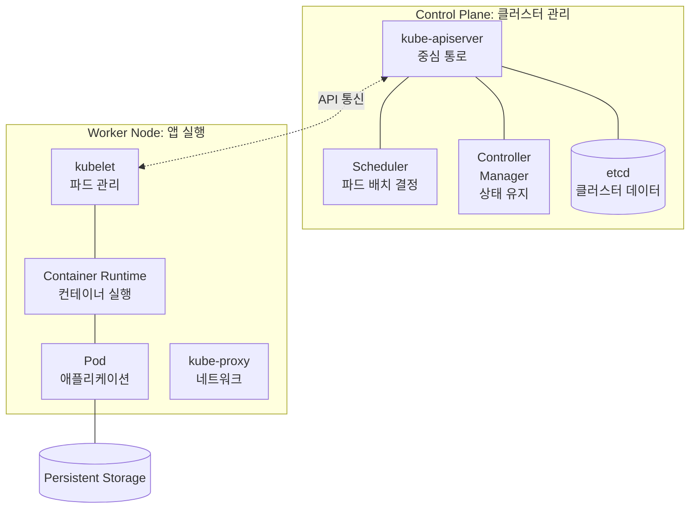

## 1. 이론
### 1.1. 클라우드 네이티브(Cloud Native)
#### (1) 개념 및 정의
- **정의**
	- 클라우드 컴퓨팅의 장점(유연성, 확장성 등)을 최대한 활용하여 애플리케이션을 개발하고 운영하는 방법론

- **CNCF 5대 요소**
	- 컨테이너
	- 서비스 메쉬
	- MSA(Microservices Architecture)
	- 불변 인프라
	- 선언형 API

#### (2) 주요 구조 (Architecture)
- **MSA(Microservices Architecture)**
	- 애플리케이션을 독립적인 작은 기능 단위로 분해하여 구축

- **Containerization (컨테이너화)**
	- MSA로 개발된 앱을 효과적으로 배포 및 활용하는 기술

- **가상화 비교**
	- **컨테이너**: OS 공유, 경량화(최소한의 요소), 빠른 시작/종료
	- **가상 머신(VM)**: 전체 OS 포함(무거움), 리소스 소모 큼, 독립된 OS 사용

#### (3) 장단점 및 현황
- **장점**: 개발/릴리스 속도 향상, 비용 절감, 관리 용이성
- **단점**: 벤더 락인(Vendor Lock-in) 우려, 높은 기술력 요구
- **현황**: 가트너에 따르면 2022년 기준 사용률 40% 미만이나 점차 확대 추세

### 1.2. 컨테이너 기술과 도커(Docker)
#### (1) 컨테이너의 이해
- **개념**
	- 소스 코드, 종속성 등을 하나로 패키징한 논리적 공간

- **유형**
	- **시스템 컨테이너**: 기존 OS 위에 컨테이너 형식으로 운영
	- **애플리케이션 컨테이너**: 단일 앱 실행 목적 (하나의 OS 위에서 3-Tier 구성 등 가능)

#### (2) 도커(Docker)
- **역할**
	- 애플리케이션을 독립된 환경에서 실행하게 해주는 오픈 소스 플랫폼 (MSA에 유용)

- **이미지(Image) 특징**
	- **Stateless**: 변경되는 상태 값을 보유하지 않음
	- **구조**
		- 바이너리, 라이브러리 포함
		- 계층(Layer) 구조를 가짐(JSON 형태 메타데이터)

- **이미지 관리 (Registry)**
	- **Public**: Docker Hub 등 인터넷을 통해 공유
	- **Private**: 기업 내부 보안을 위해 별도 구축 (OS 설정, 미들웨어 정보 등 민감 정보 보호)
	- **Lifecycle**: Pull(다운로드), Push(업로드), Delete(용량 관리 필요)

#### (3) CI/CD(지속적 통합/배포)
- **CI**: 코드 변경 사항을 자주 통합
- **CD**: 변경 사항을 자동으로 배포
- **목표**: 개발 단계 자동화를 통한 짧은 주기의 서비스 제공 및 개선

### 1.3. 쿠버네티스 (Kubernetes, k8s)
#### (1) 필요성
- 도커만으로는 분산된 수많은 컨테이너를 관리하기 어려움 -> 오케스트레이션 도구 필요

#### (2) 주요 특징 및 아키텍처 키포인트
- **기능**
	- 서비스 디스커버리 & 로드밸런싱
	- 자동 롤아웃/롤백
	- 자가 치유(Self-healing)
	- 자동 빈 패킹(Bin-packing)
	- 스토리지 오케스트레이션
	- 시크릿 관리

- **핵심 원칙**
	- 선언적 구성
	- 분산된 기능 단위(Object)
	- 중앙 제어
	- 동적 그룹화
	- API 기반 상호작용

#### (3) 아키텍처 구성 요소
**Control Plane은 관리 영역, Worker Node는 앱 실행 영역**이다. 우선 상자 안에 어떤 요소가 들어가는지 읽는다. 실선은 구성 관계를 뜻한다.

Worker Node 하나를 대표로 그렸다. kube-proxy는 같은 노드에서 네트워크를 관리하는 구성 요소이며, 위 그림은 전체 통신 경로를 모두 표현한 것은 아니다.

- **Control Plane (마스터 영역)**
	- `kube-apiserver`: API 서버 (중심 통로)
	- `kube-scheduler`: 스케줄러 (파드 배치 결정)
	- `kube-controller-manager`: 컨트롤러 매니저 (상태 유지)
	- `etcd`: 클러스터 데이터 저장소

- **Worker Node (실제 실행 영역)**
	- `Pod`: 애플리케이션의 실행 단위 인스턴스
	- `Node`: 컴퓨팅 자원
	- `kubelet`: 파드 관리 에이전트
	- `kube-proxy`: 네트워크 트래픽 관리
	- `Container Runtime`: 컨테이너 실행 엔진

- **Storage**: Persistent Storage (영구 데이터 저장)

### 1.4. 보안 및 네이버클라우드 서비스
#### (1) Cloud Activity Tracer (보안)
- **제로 트러스트(Zero Trust) 관점**
	- 접근 활동 모니터링 및 비정상 행위 탐지
	- 감사/추적성 제공 및 권한 검증 보조
	- 위협 대응 연계

#### (2) Ncloud Kubernetes Service 특징
- **확장성**: 클러스터 Pod 및 노드 수량 자동 확장(Auto-scaling) 지원
- **인프라**: 고성능 워커 노드, 블록 스토리지/NAS 연동, Load Balancer 연동
- **운영/관리**: 데이터 시각화 및 모니터링 용이, Velero 플러그인 지원(백업 등)
- **보안**: 보안성 강화 가능

## 1. 사전 준비 및 네트워크 구성
- **네트워크 아키텍처**
	- NKS 실습을 위한 VPC 및 서브넷(Public, Private, Load Balancer, NAT Gateway 등) IP 대역이 정의되어 있다.

- **서버 구성**
	- `edu-nks-kubectl` (관리 서버) 및 워커 노드들의 IP 구성이 명시되어 있다.

## 2. Kubernetes 명령어 기초 (Cheat Sheet)
실습에 필요한 주요 `kubectl` 명령어를 정리했다.

- **조회**
	- `get` (Pods, Services, Nodes, Deployments)

- **상세 정보**
	- `describe` (리소스 상태 및 이벤트 확인, 디버깅 용도)

- **로그 및 실행**
	- `logs` (컨테이너 로그)
	- `exec` (컨테이너 내부 명령어 실행/접속)

- **생성 및 삭제**
	- `apply` (YAML 적용)
	- `create`
	- `delete`

## 3. NKS 관리 서버(Bastion) 구축 및 설정
보안을 위해 Private Subnet에 있는 워커 노드에 접근하기 위한 관리 서버를 생성하고 설정한다.

- **서버 생성**
	- Ubuntu 22.04 기반의 관리 서버 생성

- **필수 도구 설치**
	- `ncp-iam-authenticator`: IAM 인증을 통해 클러스터에 접근하기 위한 도구
	- `kubectl`: 쿠버네티스 제어 CLI 도구

- **인증 설정**
	- Ncloud API 인증키(Access Key, Secret Key)를 환경변수로 등록
	- `~/.ncloud/configure` 파일 설정
	- `kubeconfig` 파일을 생성 및 업데이트하여 클러스터 연결 권한 획득

## 4. 스토리지 실습 (Persistent Volume)
쿠버네티스 파드(Pod)에 영구 스토리지를 연결하는 두 가지 방식을 실습힌다.

- **실습 1: Block Storage (CSI)**
	- `ReadWriteOnce` 모드 사용 (하나의 노드에서만 접근 가능)
	- `nks-block-storage` 스토리지 클래스를 사용하여 PVC 생성 후 Pod에 마운트

- **실습 2: NAS Storage (CSI)**
	- `ReadWriteMany` 모드 사용 (여러 노드에서 동시 읽기/쓰기 가능)
	- `nks-nas-csi` 스토리지 클래스를 사용하여 공유 볼륨 생성
	- 서로 다른 Pod 간 데이터 공유 확인

## 5. 클러스터 오토스케일러(Cluster Autoscaler)
- **개념**
	- 파드의 자원 요청량에 따라 클러스터 노드 수를 자동으로 늘리거나 줄이는 기능

- **설정**
	- NKS 콘솔의 노드풀 설정에서 최소/최대 노드 수를 지정

- **실습**
	- `php-apache` 디플로이먼트의 레플리카 수를 늘려 부하를 발생시키고,
	- 노드가 자동으로 추가(Scale-out)되는 과정을 확인

## 6. 모니터링 및 대시보드
- **NKS Dashboard**
	- 쿠버네티스 대시보드 및 Grafana 대시보드를 기본 제공하여 리소스 상태를 시각적으로 확인 가능

## 7. 미니 프로젝트 (애플리케이션 배포 실습)
단순한 웹 서버 외에 흥미로운 애플리케이션을 배포하여 LoadBalancer 서비스 동작을 확인한다.

- **2048 게임**
	- Deployment와 LoadBalancer Service를 이용해 웹 게임 배포

- **채팅 서비스**
	- 간단한 채팅 앱 배포 및 외부 접속 확인

- **Quake 3 (FPS 게임)**
	- 게임 서버 컨테이너 배포
	- ConfigMap을 이용한 설정 관리
	- LoadBalancer를 통한 외부 접속

- **슈퍼 마리오 게임**
	- 웹 기반 마리오 게임 배포
