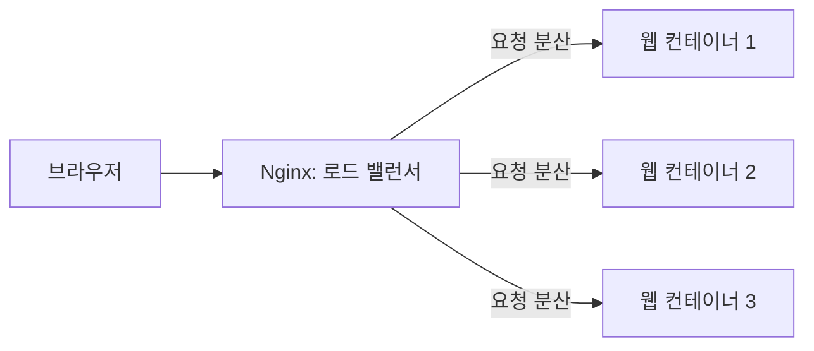
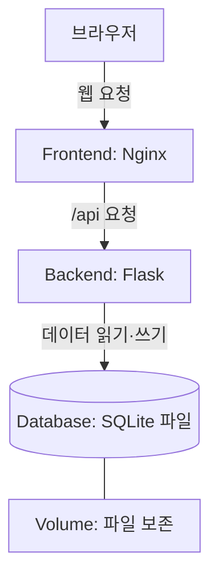

## 1. 보안 개념: Stateful vs Stateless
- **Stateful** (상태 저장)
	- 연결 상태(세션)를 기억함
	- Inbound 규칙만 허용하면 Outbound는 자동으로 허용됨
	- *예:* AWS Security Group, NCP ACG

- **Stateless** (상태 비저장)
	- 세션 정보를 저장하지 않음
	- Inbound와 Outbound 규칙을 각각 따로 명시해야 함
	- *예:* Network ACL(NACL)

- **실습 환경**
	- Default NACL(Stateless)을 그대로 사용하고,
	- ACG(Stateful)를 설정하여 서버 접근 제어(SSH 22, HTTP 80 등)를 관리

## 2. Docker 명령어 기초
- **이미지 관리**
	- `docker pull [이미지명]`: 이미지 다운로드
	- `docker images`: 이미지 목록 확인
	- `docker rmi [이미지명]`: 이미지 삭제
	- `docker build -t [이름:태그] .`: Dockerfile을 이용해 이미지 빌드

- **컨테이너 관리**
	- `docker run -d --name [이름] -p [호스트포트:컨테이너포트] [이미지]`: 컨테이너 생성 및 백그라운드 실행
	- `docker ps` / `docker ps -a`: 실행 중/전체 컨테이너 목록 확인
	- `docker stop`, `docker start`, `docker restart`: 컨테이너 제어
	- `docker rm`: 컨테이너 삭제
	- `docker logs`: 로그 확인
	- `docker exec -it [이름] /bin/bash`: 실행 중인 컨테이너 내부 셸 접속
	- `docker cp`: 호스트와 컨테이너 간 파일 복사

## 3. Docker 실습 환경
- **Play with Docker**(PWD)
	- 웹 기반의 무료 Docker 실습 환경

- **Ubuntu 환경 구축**
	- Ubuntu 22.04 VM에 Docker Engine 설치
	- 패키지 업데이트 및 필수 의존성 설치 (`apt-get`)
	- Docker 공식 GPG 키 추가 및 저장소 설정
	- Docker Engine, CLI, Compose 플러그인 설치

## 4. Nginx 웹 서버 실습
- **기본 실행**
	- `docker run`을 통해 Nginx 배포 및 포트 포워딩(8000:80) 테스트

- **커스텀 이미지 빌드**
	- `index.html` 파일을 수정하여 나만의 웹페이지 생성
	- `Dockerfile` 작성: `FROM`(베이스 이미지), `COPY`(파일 복사), `EXPOSE`(포트 명시), `CMD`(실행 명령어)
	- 이미지 빌드 후 실행하여 변경된 웹페이지 확인

## 5. MySQL 데이터베이스 실습
- **기본 실행**
	- `MYSQL_ROOT_PASSWORD` 환경 변수를 설정하여 실행

- **설정 커스터마이징**
	- 외부 접속 허용을 위해 설정 파일(`mysqld.cnf`)의 `bind-address` 수정
	- 초기화 스크립트(`init.sql`)를 `/docker-entrypoint-initdb.d/`에 복사하여 컨테이너 실행 시 DB 및 사용자 자동 생성
	- 이를 자동화하는 `Dockerfile` 작성 및 빌드

## 6. Portainer (Docker GUI 도구)
- **개요**: Docker 및 Kubernetes 환경을 웹 GUI로 관리하는 도구
- **설치**: Docker 소켓(`/var/run/docker.sock`)을 볼륨으로 마운트하여 컨테이너로 실행
- **기능**: 웹 브라우저(9000번 포트)를 통해 컨테이너, 이미지, 네트워크, 볼륨 등을 시각적으로 관리 및 배포 가능

## 7. Docker Registry 및 이미지 백업
- **Docker Hub**
	- `docker login`: 계정 로그인
	- `docker tag`: 이미지에 사용자 ID 태그 추가
	- `docker push`: Hub로 이미지 업로드

- **이미지 백업/복원**
	- `docker save`: 이미지를 tar 파일로 추출
	- `docker load`: tar 파일에서 이미지 복원

- **Private Registry 구축**
	- 로컬 환경에 사설 레지스트리 컨테이너(registry) 실행 (5000번 포트)
	- `daemon.json`에 `insecure-registries` 설정 필요
	- 사설 레지스트리를 통한 이미지 Push/Pull 실습

## 8. Load Balancer (Nginx) & Docker Compose
- **Docker Compose**
	- 여러 컨테이너의 설정(이미지, 네트워크, 볼륨 등)을 `docker-compose.yml` 파일 하나로 정의하고 관리

- **로드 밸런싱 실습**
	- 3개의 웹 서버 컨테이너(Server 1, 2, 3) 생성
	- 1개의 Nginx 로드 밸런서 컨테이너 생성
	- Nginx 설정(`nginx.conf`)의 `upstream` 기능을 이용해 요청을 3개의 서버로 분산

## 9. 미니 프로젝트: 3-Tier Architecture
**요청 처리 경로**: Nginx가 API 요청을 Flask에 전달하고, Flask가 SQLite 파일을 읽고 쓴다.

응답은 요청의 반대 방향으로 돌아온다. SQLite는 별도 DB 서버가 아니라 파일 기반 DB이며, 볼륨을 통해 파일을 보존한다.

- **구성 요소**
	- **Frontend**: HTML/JS 및 Nginx 설정(Reverse Proxy). `/api` 요청을 백엔드로 전달
	- **Backend**: Python Flask 앱. DB에 데이터를 저장(POST)하거나 조회(GET)하는 API 제공
	- **Database**: SQLite 파일 사용 (볼륨을 통해 데이터 영속성 보장)

- **실행**
	- `docker-compose up -d --build` 명령어로 전체 스택을 한 번에 배포 및 연동 확인

## 10. Docker Swarm (오케스트레이션)
- **개요**
	- 여러 Docker 호스트를 클러스터로 묶어 관리하는 컨테이너 오케스트레이션 도구

- **구성**
	- Manager Node(관리)와 Worker Node(작업)로 구성

- **주요 명령어**
	- `docker swarm init`: 스웜 클러스터 초기화 (Manager)
	- `docker swarm join`: 워커 노드를 클러스터에 합류
	- `docker node ls`: 노드 상태 확인

- **서비스 배포**
	- `docker service create`: 스웜 서비스 생성
	- `--replicas`: 컨테이너(Task) 복제본 수 설정 (Scale Out)
	- `docker service scale`: 운영 중 서비스의 복제본 수 조절

- **특징**
	- 여러 노드에 컨테이너가 분산 배포되며,
	- 어느 노드로 접근하더라도 로드 밸런싱되어 서비스에 연결됨(Routing Mesh)
