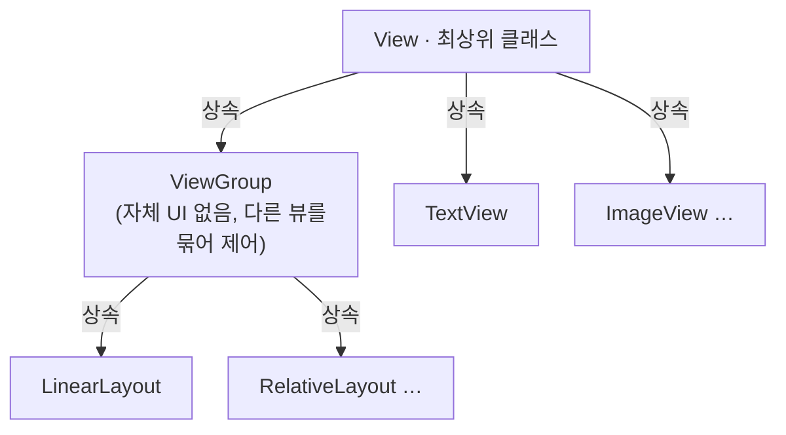

## 요약
|    항목     |                   내용                   |
| :-------: | :------------------------------------: |
| **뷰 계층**  | View/ViewGroup/Layout, View/TextView 등 |
| **id 속성** |         `android:id="@+id/id1`         |
| **크기 속성** |  `wrap_content`, `match_parent`, `sp`  |
| **간격 속성** |          `margin`, `padding`           |
| **표시 속성** |     `View.VISIBLE/INVISIBLE/GONE`      |

## 1. 화면을 구성하는 방법
### 1.1. 액티비티-뷰 구조
- 안드로이드 앱은 **액티비티, 서비스, 브로드캐스트 리시버, 콘텐츠 프로바이더** 등의 컴포넌트로 구성
- 액티비티는 화면을 출력하는 컴포넌트이며, 화면에 내용을 표시하려면 **뷰(View) 클래스**를 이용

- *메모*
	- 화면에 표시되는 요소 하나가 뷰 하나
	- 머터리얼 디자인에 따라 텍스트 하드코딩 등을 금지하는 추세

### 1.2. 화면 구성 방법 2가지
#### (1) 레이아웃 XML로 화면 구성 (권장)
- 뷰를 XML 태그로 명시하여 화면 구성
- 액티비티에서 `setContentView(R.layout.activity_main)`으로 출력

#### (2) 액티비티 코드로 화면 구성
- 뷰 클래스를 액티비티 코드에서 직접 생성
- **범위 지정 함수(Scope Function)** 활용 → 가독성 향상, 유지보수 효율적
	- `apply`: 객체 자신을 `this`로 접근, 객체 자신 반환
	- `also`: 객체 자신을 `it`으로 접근

```kotlin
val layout = LinearLayout(this).apply {
    orientation = LinearLayout.VERTICAL
    addView(name, WRAP_CONTENT, WRAP_CONTENT)
}
setContentView(layout)
```

## 2. 뷰 클래스
### 2.1. 뷰 객체의 계층 구조


|    클래스    |                   역할                    |
| :-------: | :-------------------------------------: |
|   **View**    | 모든 뷰 클래스의 최상위, 액티비티는 View의 서브클래스만 출력 가능 |
| **ViewGroup** |          자체 UI 없이 여러 뷰를 묶어 제어           |
| **TextView**  |         특정 UI(텍스트 등)를 출력하는 클래스          |

### 2.2. 레이아웃 클래스
- `ViewGroup`의 하위 클래스
- 다른 뷰 객체(TextView, ImageView 등)를 담아 한꺼번에 제어
- **레이아웃 중첩** 가능 → 복잡한 화면 구성 시 레이아웃 안에 레이아웃을 넣어 사용

## 3. 뷰의 핵심 속성
### 3.1. id
> 레이아웃 XML의 뷰를 코드에서 사용하기

- **id 속성**
	- 뷰 객체를 식별하는 식별자 (생략 가능, 앱 내 유일한 이름)
	- XML에 `android:id="@+id/text1"` 추가 → `R.java`에 상수 변수로 자동 등록
	- `@`로 시작 = R.java에서 관리하는 리소스

- **`setContentView()`**: 액티비티 화면 출력 함수 → 호출 시 뷰 객체 생성
- **`findViewById()`**: id값으로 생성된 뷰 객체를 코드에서 가져오는 함수

```kotlin
setContentView(R.layout.activity_main)
val textView1 = findViewById<TextView>(R.id.text1)
```

### 3.2. 뷰의 크기 (layout_width/height)
> 뷰의 크기를 지정하는 필수 속성

- 크기 설정 속성: `layout_width`, `layout_height`

|        값        |         설명         |
| :-------------: | :----------------: |
| `wrap_content`  |   내부 콘텐츠 크기에 맞춤    |
| `match_parent`  | 상위(부모) 레이아웃 크기에 맞춤 |
| 수치 (예: `100dp`) |      직접 크기 지정      |

### 3.3. 뷰의 간격 (margin/padding)
|    속성     |        설명        |
| :-------: | :--------------: |
| `margin`  |   뷰와 뷰 사이의 간격    |
| `padding` | 뷰와 내부 콘텐츠 사이의 간격 |

- 방향별 지정
	- `paddingLeft`, `paddingRight`, `paddingTop`, `paddingBottom`
	- `layout_marginLeft`, `layout_marginRight`, `layout_marginTop`, `layout_marginBottom`

### 3.4. 뷰의 표시 여부
- `visibility` 속성으로 제어

|      값      |         설명          |
| :---------: | :-----------------: |
|  `visible`  |       화면에 표시        |
| `invisible` |   숨김, **자리는 차지함**   |
|   `gone`    | 숨김, **자리도 차지하지 않음** |

- 코드에서 동적으로 변경
```kotlin
targetView.visibility = View.VISIBLE
targetView.visibility = View.INVISIBLE
```

## 4. 기본적인 뷰 살펴보기
### 4.1. TextView
- **TextView** (텍스트 뷰)
	- 문자열을 화면에 출력하는 뷰

|         속성          |       설명       |                           예시                           |
| :-----------------: | :------------: | :----------------------------------------------------: |
|   `android:text`    |   출력할 문자열 지정   |          `"helloworld"` 또는 `"@string/hello"`           |
| `android:textColor` |  문자 색상 (RGB)   |                      `"#FF0000"`                       |
| `android:textSize`  |     문자 크기      |                        `"20sp"`                        |
| `android:textStyle` |     문자 스타일     |               `bold`, `italic`, `normal`               |
| `android:autoLink`  |    자동 링크 추가    |            `web`, `phone`, `email` (복수 시 `             |
| `android:maxLines`  |   최대 표시 줄 수    |                         `"3"`                          |
| `android:ellipsize` | 줄임표(...) 표시 위치 | `end`, `middle`(singleLine 필요), `start`(singleLine 필요) |

### 4.2. ImageView
- **ImageView** (이미지 뷰)
	- 이미지를 화면에 출력하는 뷰

|                   속성                    |                  설명                   |
| :-------------------------------------: | :-----------------------------------: |
|              `android:src`              |    출력할 이미지 지정 (`@drawable/image3`)    |
| `android:maxWidth`, `android:maxHeight` |             이미지 최대 크기 지정              |
|       `android:adjustViewBounds`        | `true`로 설정 시 이미지 가로/세로 비율에 맞게 뷰 크기 조정 |

### 4.3. Button / CheckBox / RadioButton
|       뷰       |               역할                |
| :-----------: | :-----------------------------: |
|   `Button`    |           사용자 이벤트 처리            |
|  `CheckBox`   |              다중 선택              |
| `RadioButton` | 단일 선택 (반드시 `RadioGroup`과 함께 사용) |

> `RadioGroup`으로 묶인 라디오 버튼 중 **하나만** 선택 가능

### 4.4. EditText
- **EditText** (에디트 텍스트)
	- 사용자로부터 텍스트를 입력받는 뷰

|         속성          |                설명                |
| :-----------------: | :------------------------------: |
|   `android:lines`   |      처음부터 여러 줄 크기로 표시 (정적)       |
| `android:maxLines`  | 처음엔 한 줄, 입력에 따라 지정 크기까지 늘어남 (동적) |
| `android:inputType` |        입력 시 사용할 키보드 유형 지정        |

|  주요  `inputType` 속성값  |          설명          |
| :-------------------: | :------------------: |
|        `text`         |      문자열 한 줄 입력      |
|    `textPassword`     | 비밀번호 입력 (문자가 점으로 표시) |
| `textVisiblePassword` |  입력 문자 표시되는 비밀번호 모드  |
|    `textMultiLine`    |       여러 줄 입력        |
|       `number`        |        숫자 입력         |
|   `numberPassword`    |   숫자 키만 입력, 점으로 표시   |
|        `phone`        |      전화번호 입력 모드      |
|  `textEmailAddress`   |     이메일 주소 입력 모드     |

> 개발 버전에 따라 반영이 안될 수 있으므로 **배포 전 반드시 테스트** 필요

## 5. 뷰 바인딩
- **뷰 바인딩** (View Binding)
	- 레이아웃 XML에 선언한 뷰 객체를 코드에서 쉽게 이용하는 방법
	- `findViewById()` 없이 뷰 객체에 접근 가능
	- 이전 방식인 `kotlin-android-extensions`는 현재 **deprecated** 상태

### 5.1. 설정 방법
- 모듈 수준 `build.gradle`의 `android { }` 내부에 추가 후 Sync
```gradle
android {
    viewBinding { enable = true }
}
```

### 5.2. 사용 방법
- **바인딩 클래스 자동 생성 규칙**
	- 레이아웃 XML 파일명 → 파스칼케이스 + `Binding` 접미사

|       XML 파일명       |      자동 생성 클래스명       |
| :-----------------: | :-------------------: |
| `activity_main.xml` | `ActivityMainBinding` |
|   `item_main.xml`   |   `ItemMainBinding`   |

```kotlin
// inflate()로 바인딩 객체 획득
val binding = ActivityMainBinding.inflate(layoutInflater)
setContentView(binding.root)

// 뷰 객체 이용 (xml의 id값으로 접근)
binding.visibleBtn.setOnClickListener {
    binding.targetView.visibility = View.VISIBLE
}
```

- 필드로 선언 시 (늦은 초기화 필수)
```kotlin
private val binding: ActivityMainBinding by lazy {
    ActivityMainBinding.inflate(layoutInflater)
}
```
