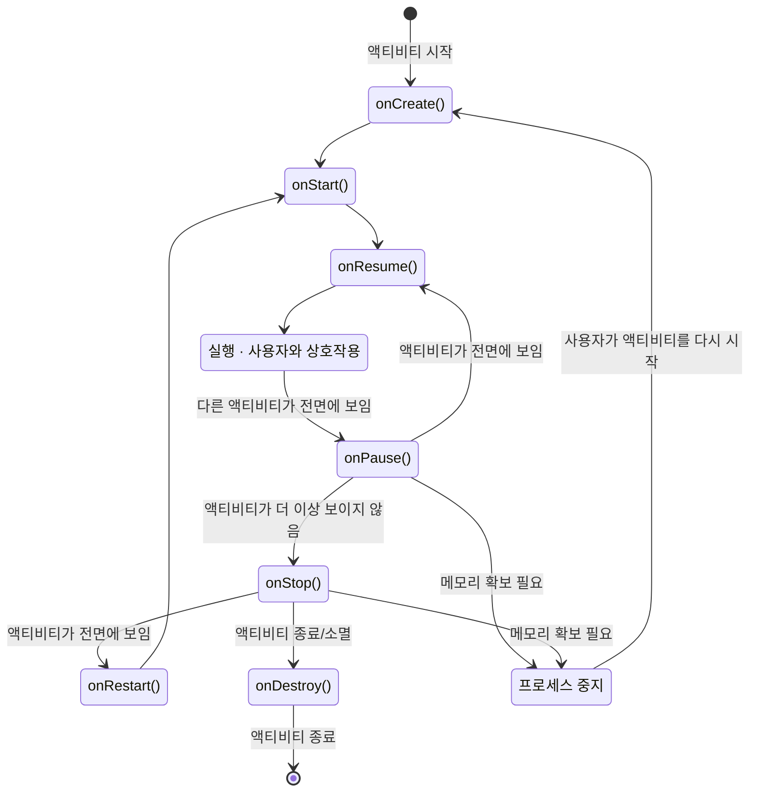

## 요약
|                      항목                       |             내용             |
| :-------------------------------------------: | :------------------------: |
|               `exported="true"`               |     외부에서 해당 액티비티 실행 가능     |
|                 `action.MAIN`                 | 앱의 첫 진입점(Entry Point)으로 동작 |
|              `category.LAUNCHER`              | 앱의 첫 진입점(Entry Point)으로 동작 |
|     `Intent(this, Activity::class.java)`      |          명시적 인텐트           |
|            `putExtra(key, value)`             |           데이터 추가           |
|              `getXXXExtra(key)`               |          데이터 가져옴           |
|            `startActivity(intent)`            |        사후처리 불필요한 경우        |
| `startActivityForResult(intent, requestCode)` |        사후처리 필요한 경우         |
|        `ActivityResultLauncher` Class         | 사후처리 필요한 경우 (Android 11~)  |
|        `setResult(RESULT_OK, intent)`         |      인텐트에 결과 데이터를 삽입       |
|                  `finish()`                   |         현재 액티비티 종료         |
|               `<intent-filter>`               |         암시적 인텐트 정보         |
|              `Dispatchers.Main`               |       메인 스레드(UI 변경)        |
|               `Dispatchers.IO`                |         IO 최적화 스레드         |
|             `Dispatchers.Default`             |         백그라운드 스레드          |

## 1. 인텐트
- **인텐트** (Intent)
	- ==컴포넌트 간에 데이터를 전달하는 메시지 객체==
	- 안드로이드의 컴포넌트 클래스(액티비티, 서비스, 브로드캐스트 리시버 등)는 개발자가 코드에서 **직접 생성·실행 불가**
	- 반드시 **안드로이드 시스템에 인텐트를 전달** → 시스템이 분석하여 적합한 컴포넌트 실행
	- 외부 앱의 컴포넌트와 연동할 때도 동일한 방식 사용

### 1.1. 액티비티 추가 및 매니페스트 등록
- ==모든 액티비티는 AndroidManifest.xml에 \<activity> 태그로 등록 필수==
	- *안드로이드 시스템에 사용 컴포넌트를 알린다.*
	- `android:name` 속성 생략 불가
	- `android:exported="true"`: 외부 앱·OS에서 해당 액티비티 실행 가능 여부

```xml
<activity
	android:name=".DetailActivity"
	android:exported="true" />

<activity
	android:name=".MainActivity"
	android:exported="true">
    <intent-filter>
        <action android:name="android.intent.action.MAIN" />
        <category android:name="android.intent.category.LAUNCHER" />
    </intent-filter>
</activity>
```

> `MAIN` 액션 + `LAUNCHER` 카테고리 두 설정이 모두 있어야 앱의 첫 진입점(Entry Point)으로 동작

### 1.2. 인텐트 엑스트라 데이터
- **Extra Data (데이터 전달)**
	- 인텐트에 **부가 정보(데이터)** 를 담아 전달하는 방법
	- ==putExtra(key, value)==로 데이터 추가
	- ==getXXXExtra(key)==로 데이터 가져옴 (타입별 메서드 상이)

1. **실행할 대상 컴포넌트**
	- 인텐트 객체를 생성할 때 요청하는 클래스와 요청할 클래스 정보를 담음
```kotlin
val intent: Intent = Intent(this, DetailActivity::class.java)
```

2. **인텐트 엑스트라 데이터 추가**: `intent.putExtra("Key", Value)`
	- `putExtra()`로 인텐트에 컴포넌트 실행을 요청할 때 데이터를 함께 전달하려면 엑스트라 데이터에 저장
```kotlin
// 데이터 추가 (이전 액티비티)
intent.putExtra("data1", "hello")
intent.putExtra("data2", 10)

startActivity(intent)
```

3. **엑스트라 데이터 가져오기**: `intent.get___Extra("Key")`
```kotlin
// 데이터 가져오기 (다음 액티비티)
// intent.getIntExtra("Key", DefaultValue)
val data1 = intent.getStringExtra("data1")	// 기본값 없음; 없으면 null 반환
val data2 = intent.getIntExtra("data2", 0)	// 두 번째 인자 = 기본값
```

### 1.3. 액티비티 실행
|             방법             |      특징      |             비고              |
| :------------------------: | :----------: | :-------------------------: |
|  `startActivity(intent)`   | 사후처리 불필요한 경우 |    화면 복귀 시 `finish()` 사용    |
| `startActivityForResult()` | 사후처리 필요한 경우  |   Deprecated (API 30 이하)    |
|  `ActivityResultLauncher`  | 사후처리 필요한 경우  | **Android 11(API 30)부터 권장** |

#### (1) `startActivity(intent)`
```kotlin
val intent = Intent(this, DetailActivity::class.java)
startActivity(intent)
```
- 현재 화면을 닫고 이전으로 돌아갈 때 → `finish()` 호출

#### (2) `startActivityForResult(intent, requestCode)`
```kotlin
// 호출 측: requestCode로 인텐트 식별
startActivityForResult(intent, 10)

// 결과 측: 데이터를 담아 이전 액티비티로 전달
intent.putExtra("resultData", "world")
setResult(RESULT_OK, intent)
finish()

// 호출 측: 결과 수신 콜백
override fun onActivityResult(requestCode: Int, resultCode: Int, data: Intent?) {
    super.onActivityResult(requestCode, resultCode, data)
    if (requestCode == 10 && resultCode == Activity.RESULT_OK) {
        val result = data?.getStringExtra("resultData")
    }
}
```

- `requestCode`: 여러 인텐트 구분용 식별 코드
- `resultCode`: `RESULT_OK` / `RESULT_CANCELED`
- 결과 반환 시 `onActivityResult()` 자동 호출

#### (1) `ActivityResultLauncher` 클래스 (권장)
```kotlin
// 1. Launcher 생성 (Contract + Callback 등록)
val requestLauncher: ActivityResultLauncher<Intent> =
    registerForActivityResult(ActivityResultContracts.StartActivityForResult()) { result ->
        if (result.resultCode == Activity.RESULT_OK) {
            val message = result.data?.getStringExtra("userInput")
            binding.textViewResult.text = "받은 메시지: $message"
        }
    }

// 2. 실행
val intent = Intent(this, DetailActivity::class.java)
requestLauncher.launch(intent)
```

- `registerForActivityResult(Contract, Callback)` 로 생성
- ==launch() 호출== 시 Contract 실행
- 결과 전달 방식은 `startActivityForResult()`와 동일

### 1.4. 결과 반환
1. **메인 -> 서브 호출**
	- `startActivityForResult(intent, RequestCode)`

2. **서브 -> 메인 결과 반환**
	1. 인텐트에 결과 데이터를 `putExtra`로 담은 후,
	2. ==setResult(RESULT_OK, intent)== 호출
		- 결과를 이전 액티비티에 전달할 수 있도록 인텐트에 데이터를 삽입
		- RESULT_OK / RESULT_CANCELED 등 상수를 지정
	3. ==finish()==로 종료
		- 현재 액티비티를 메모리에서 제거하고 종료하여 이전 화면으로 돌아가는 메서드
		- *자동으로 화면을 되돌릴 때*

3. **메인에서 결과 수신**
	- 결과가 되돌아와서 다시 이전 액티비티가 화면에 보이면 `onActivityResult()`가 자동으로 호출
	- requestCode: 인텐트를 시작한 곳에서 자신이 전달한 인텐트를 구분하기 위하여 설정한 요청 코드
	- resultCode: 인텐트로 실행된 곳에서 돌려받은 결과 코드
	- data: 인텐트 객체이며 결과 데이터가 존재

### 1.5. 암시적 인텐트
|     구분      |                 방법                  |       사용 범위       |
| :---------: | :---------------------------------: | :---------------: |
| ==명시적 인텐트== |          클래스 타입 레퍼런스 직접 지정          | ==앱 내부== 컴포넌트만 가능 |
|   암시적 인텐트   | ==인텐트 필터==(action/category/data) 사용 | ==앱 내·외부== 모두 가능  |

```kotlin
// 명시적
val intent = Intent(this, DetailActivity::class.java)

// 암시적
val intent = Intent("ACTION_EDIT")
intent.data = Uri.parse("http://www.google.com")
startActivity(intent)
```

- **암시적 인텐트** (Implicit Intent)
	- 대상의 클래스명을 명시하지 않고,
	- 매니페스트 파일(`<intent-filter>`)에 선언된 정보를 바탕으로
		- 액션(Action)과 데이터(URI)만 지정
	- 시스템이 적절한 컴포넌트(앱)를 찾아 실행하는 방식

#### (1) 인텐트 필터
- **인텐트 필터**
	- 매니페스트의 `<intent-filter>` 내에 선언
	- ==매니페스트 파일에서 앱이 시작되는 첫 번째 진입점==
	
	- 외부에서도 사용될 수 있도록 설정해야 되는 컴포넌트라면 `<intent-filter>`를 설정해야 함
	- `<activity>`, `<service>`, `<receiver>` 등의 컴포넌트 하위에 작성
	- 인텐트 필터를 작성하면 해당 컴포넌트의 클래스명과 인텐트 필터 정보가 안드로이드 시스템에 등록됨

- 구성 태그
    - `<action>`: 컴포넌트의 **기능** 정보 (예: `ACTION_VIEW`, `ACTION_EDIT`)
    - `<category>`: 컴포넌트가 포함되는 **범주** 정보 (예: `LAUNCHER`, `BROWSABLE`)
    - `<data>`: 컴포넌트에 필요한 **데이터** 정보 (`scheme`, `host`, `port`, `mimeType` 등)

```xml
<!-- 암시적 인텐트 설정 예시 -->
<activity android:name=".OneActivity" />

<activity
	android:name=".TwoActivity"
	android:exported="true" > <!-- 외부 앱에서 실행 가능 허용 여부 -->
	<intent-filter>
		<!-- 외부에서 ACTION_EDIT(편집 작업) 요청이 오면 처리 -->
		<action android:name="ACTION_EDIT" />
		<!-- 암시적 인텐트 수신을 위해서는 거의 항상 포함되어야 하는 설정 -->
		<category android:name="android.intent.category.DEFAULT" />
		<data/>
	</intent-filter>
</activity>
```
> 암시적 인텐트 수신을 위해선 `DEFAULT` 카테고리가 거의 항상 필요

```kotlin
// 호출부
val intent = Intent("ACTION_EDIT")
startActivity(intent)
// 시스템이 Manifest를 분석후 TwoActivity를 찾아 실행
```

#### (2) 암시적 인텐트의 동작
|       상황       |                결과                 |
| :------------: | :-------------------------------: |
| 실행 가능한 액티비티 1개 |            선택 없이 바로 실행            |
| 실행 가능한 액티비티 n개 |              사용자가 선택              |
| 실행 가능한 액티비티 없음 | `ActivityNotFoundException` 오류 발생 |

- **예외 처리**
	- 암시적 인텐트를 처리할 수 있는 앱(액티비티)이 기기에 없을 경우 앱이 강제 종료되므로
	- `try-catch` 문을 통한 예외 처리(`ActivityNotFoundException`)가 필수이다.

```kotlin
val intent = Intent("ACTION_HELLO")
try {
	startActivity(intent)
} catch (e: Exception) {
	Toast.makeText(this, "no app...", Toast.LENGTH_SHORT).show()
}
```

- **특정 앱 지정 실행**
	- `setPackage()` 로 패키지명 지정
	- 앱 패키지명 확인: 구글 플레이 스토어 URL의 `id=패키지명` 참고
    - 예: 카카오톡 → `com.kakao.talk`

```kotlin
val intent = Intent(Intent.ACTION_VIEW, Uri.parse("geo:37.7749,127.4194"))
intent.setPackage("com.google.android.apps.maps")
startActivity(intent)
```

## 2. 액티비티 생명주기
### 2.1. 액티비티의 3가지 상태

|     상태      |                                 설명                                 |
| :---------: | :----------------------------------------------------------------: |
| **활성(실행)**  |                      화면 출력 중 + 사용자 이벤트 처리 가능                       |
|  **일시 정지**  | 화면 출력 중 + 사용자 이벤트 처리 **불가**<br>포커스 및 상호작용 X (예: 투명한 액티비티가 위에 뜬 경우) |
| **비활성(중지)** |                     화면에 **출력되지 않는** 상태 (종료 X)                      |

### 2.2. 생명주기 콜백 메서드
![[Activity_Lifecycle.png]]


- *참고*
	- Android 12(API 31)부터 앱의 루트(메인) 액티비티에서 뒤로 가기 버튼을 누르면
	- 완전히 소멸(`onDestroy`)되지 않고 `onStop` 상태로 백그라운드에 남는다.

### 2.3. 액티비티 상태 저장 (Bundle)
- **화면 회전**
	- onCreate() -> onStart -> ==on**Restore**InstranceState()== -> onResume()
	- onPause() -> onStop() -> ==on**Save**InstanceState()== -> onDestroy()

- 화면을 회전하는 등 기기 구성이 변경되면
	- 액티비티는 완전히 종료(`onDestroy`)되었다가 다시 생성(`onCreate`)되며,
	- 이때 기존 데이터가 초기화된다.

- **해결책 1**
	- `requestedOrientation` 속성으로 화면 방향을 고정한다.
	- `requestedOrientation = ActivityInfo.SCREEN_ORIENTATION_PORTRAIT` (세로)
	- `requestedOrientation = ActivityInfo.SCREEN_ORIENTATION_LANDSCAPE` (가로)

- **해결책 2 (데이터 보존)**
	- 액티비티 종료 전 `onSaveInstanceState(Bundle)`가 호출될 때 `Bundle` 객체에 데이터를 저장하고,
	- 다시 생성될 때 `onCreate()`나 `onRestoreInstanceState(Bundle)`에서 저장된 데이터를 불러와 화면을 복원한다.

```kotlin
// 데이터 저장
override fun onSaveInstanceState(outState: Bundle) {
    super.onSaveInstanceState(outState)
    outState.putString("data1", "hello")
    outState.putInt("data2", 10)
}

// 데이터 복원
override fun onRestoreInstanceState(savedInstanceState: Bundle) {
    super.onRestoreInstanceState(savedInstanceState)
    val data1 = savedInstanceState.getString("data1")
    val data2 = savedInstanceState.getInt("data2")
}
```

## 3. 액티비티 ANR 문제와 코루틴
### 3.1. ANR 오류
- **ANR** (Application Not Responding)
	- ==액티비티가 사용자 이벤트에 5초 이내에 반응하지 않으면 발생하는 시스템 오류==
	- 원인: 메인 스레드(UI 스레드)에서 시간이 오래 걸리는 작업 수행
	- 주로 네트워크 통신, 파일 I/O 등에서 발생

### 3.2. 코루틴
- **코루틴** (Coroutine)
	- 메인 스레드 대신 개발자 스레드(백그라운드)를 분리하여 무거운 작업을 처리해야 한다.
	
	- 코틀린 언어에서 제공하는 비동기 경량 스레드 (안드로이드 시스템 X)
	- 수행 흐름을 여러 갈래로 만들어 동시 처리 가능
	- 메모리 누수 적고 다양한 기능 지원

|  Coroutine Dispatcher   |     실행 위치      |       용도       |
| :---------------------: | :------------: | :------------: |
|   `Dispatchers.Main`    |     메인 스레드     |  **UI 변경 작업**  |
|    `Dispatchers.IO`     | **IO 최적화 스레드** | 파일 읽기/쓰기, 네트워크 |
| ==Dispatchers.Default== | ==백그라운드 스레드==  |   CPU 집약적 연산   |

- **데이터 통신**
	- 백그라운드 스레드에서는 UI 화면을 직접 변경할 수 없다.
	- 따라서 무거운 연산은 `Default`나 `IO`에서 수행하고,
	- 그 결과값을 `Channel` 등을 통해 메인 스레드로 안전하게 전달(`send()`, `consumeEach()`)하여 화면을 업데이트해야 한다.


### 3.3. 코루틴 사용 예시
- **Gradle 추가**
```groovy
implementation("org.jetbrains.kotlinx:kotlinx-coroutines-android:1.7.3")
```

```kotlin
val channel = Channel<Long>()

// Main 스레드: 결과 수신 후 UI 업데이트
lifecycleScope.launch(Dispatchers.Main) {
    channel.consumeEach { result ->
        binding.resultView.text = "결과 : $result"
        binding.calcButton.isEnabled = true
    }
}

// 버튼 클릭 시
binding.calcButton.setOnClickListener {
    binding.calcButton.isEnabled = false
    binding.resultView.text = "계산 중..."

    // Background 스레드: 시간이 오래 걸리는 연산
    lifecycleScope.launch(Dispatchers.Default) {
        var sum = 0L
        for (i in 1L..2_000_000_000L) sum += i
        channel.send(sum)  // 결과를 채널로 전달
    }
}
```

- `Channel`: 코루틴 간 데이터를 안전하게 주고받는 파이프
- `channel.send()`: 데이터 전달
- `channel.consumeEach {}`: 데이터 수신 및 처리

## cf. 레이팅바
- **레이팅바** (RatingBar)
	- 선호도를 평가할 때 주로 사용되는 별점 위젯

- **주요 속성**
	- `numStars`: 전체 별의 개수 (기본 5개)
	- `stepSize`: 증가할 별의 단위 (기본 0.5개, 소수점 설정 가능)
	- `rating`: 처음에 채워져 있을 별의 개수
	- `style`: 다양한 스타일 지정 가능
		- (ratingBarStyleSmall, ratingBarStyleIndicator 등)

```xml
<RatingBar  
    android:id="@+id/rbar1"  
    style="?android:attr/ratingBarStyleSmall"  
    android:layout_width="wrap_content"  
    android:layout_height="wrap_content"  
    android:numStars="9"  
    android:stepSize="1" />
```

- **동작 제어 (Kotlin)**
	- 버튼 클릭 시 rating 값에 stepSize를 더하거나 빼서 별점을 동적으로 증가/감소시킬 수 있다.
