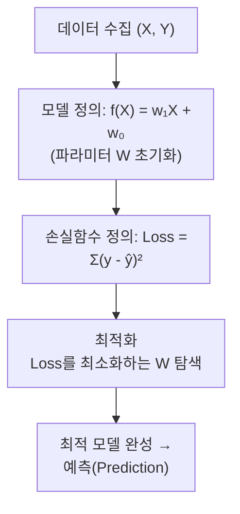

> [!note]- Supplementary Materials
> **인공지능**
> - [[01_AI Overview]]
> - [[02_ML Overview]]
> - [[03_ML Optimization]]
> 
> **LG AI연구원 9기** - Supervised Learning
> - [[01_Supervised Learning Overview]]
> - [[02_Linear Regression]]
> - [[03_Gradient Descent]]
> 
> **LG AI연구원 9기** - Tabular ML
> - [[01_Intro to Tabular ML]]

## 1. 데이터
- **관측치**(Observation), Sample, Pattern
	- 데이터의 각 행(row), n개

- **변수**(Variable), **특성**(Feature), Factor
	- 각 관측치의 특성치, p개

### 1.1. 정형 데이터의 관점
- **정형 데이터**
	- 테이블, 스프레드시트처럼 행과 열로 구조화된 데이터
	- 컬럼을 통해 의미를 쉽게 파악 가능
	- 앙상블, 결정트리, 선형회귀 등에 주로 활용

- *변수의 유형*
	- **이산형** (Discrete)
		- **명목형** (범주형; Categorical)
			- 클래스 간 순서 없음
			- 예: 사과/배/바나나
		- **순서형** (Ordinal)
			- 클래스 간 순서 있음
			- 예: 상/중/하
	- **연속형** (Continuous)
		- 실수 형태의 연속값
		- 예: 키, 몸무게

### 1.2. 비정형 데이터의 관점
- 정형 데이터보다 비정형 데이터가 수집되기 쉽지만, 기존의 도구로는 의미 파악이 어려운 문제가 있다.
- 여기서 딥러닝이 비정형 데이터로부터 의미있는 특징을 추출(feature extraction)하여, 정형 데이터 형태로 변환하는 기능을 수행한다.
- 즉, 특성 추출 및 분류를 컴퓨터가 처리하게 하는 것이다.

*CIFAR-10*
- 머신러닝, 특히 이미지 분류 연구에서 널리 쓰이는 벤치마크 데이터셋

## 2. 머신러닝
> Input $x →$ Function $f(x) →$ Output $y$

- [Machine Learning이란?](https://mlatcl.github.io/gpss/lectures/01-uncertainty-and-modelling)
	- 머신러닝은 **데이터**와 **모델**을 결합하는 과정인데, 두 가지 핵심 요소가 필요하다:
	
	1. **예측 함수 (Prediction Function)**
	    - 세상의 패턴이나 규칙에 대한 우리의 가정을 담은 함수
	    - 입력 데이터를 받아 결과를 예측함
	
	2. **목적 함수 (Objective Function)**
	    - 예측이 틀렸을 때 **얼마나 틀렸는지** 측정하는 함수
	    - 이 오차를 줄이는 방향으로 모델이 학습됨
	
	- 쉽게 말하면, "어떻게 예측할까"와 "얼마나 잘못됐는지 어떻게 잴까"를 정의하는 것이 머신러닝의 핵심이다.

- 머신 러닝의 학습 유형은 크게 세 가지로 나뉜다.
	1. **지도 학습** (Supervised Learning)
		- ==데이터에 정답(Label)이 있음==
	2. **비지도 학습** (Unsupervised Learning)
		- ==데이터에 정답(Label)이 없음==
	3. **강화 학습** (Reinforcement Learning)

- *cf. 문제 정의 단계에서 지도 학습/비지도 학습을 결정한다.*

### 2.1. 지도 학습
> *본 강의는 지도 학습의 관점에서 딥러닝을 다룰 예정이다.*

> $Y=f(X)$

- ==지도 학습 (Supervised Learning)==
	- 정답(label)이 있는 학습 데이터로부터
	- Input($X$)과 Output($Y$)의 관계를 가장 잘 설명하는 함수 $f(X)$를 찾아내는 방법론

|           입력 변수 ($X$)           |          출력 변수 ($Y$)          |
| :-----------------------------: | :---------------------------: |
| **독립변수** (Independent variable) | **종속변수** (Dependent variable) |
| **예측변수** (Explanatory variable) | **반응변수** (Response variable)  |
|    **인풋변수** (Input variable)    |  **아웃풋변수** (Output variable)  |
|                -                |  **타겟변수** (Target variable)   |

#### 문제 유형
1. ==회귀 (Regression)==
	- **연속적인 수치**를 예측하는 문제 (종속변수 $Y$가 **연속형**)
		- 부동산 가격 예측: 집의 크기, 위치, 연식 등($X$)을 통해 집값($Y$) 예측
		- 온도 예측: 기상 데이터($X$)를 통해 내일의 기온($Y$) 예측
		- 매출 예측: 지난달 광고비와 판매량($X$)을 바탕으로 이번 달 매출액($Y$) 예측
	
	- **알고리즘**
		- 선형 회귀(Linear Regression), 의사결정 나무(Decision Tree Regressor), 랜덤 포레스트(Random Forest Regressor) 등
	- **손실 함수** (Loss Function)
		- 평균 제곱 오차(**MSE**; Mean Squared Error)
		- 평균 절대 오차(**MAE**; Mean Absolute Error)
		- Huber Loss
	- **평가 지표** (Evaluation Metrics)
		- RMSE(Root MSE), MAE, $R^2$ Score(결정계수)

2. ==분류 (Classification)==
	- **범주**(Category; 클래스)를 예측하는 문제 (종속변수 $Y$가 **범주형**)
		- 스팸 메일 분류: 메일 내용($X$)이 스팸인지 정상인지($Y$) 분류
		- 질병 진단: 환자의 검사 결과($X$)를 바탕으로 질병 유무 또는 종류($Y$) 판별
		- 이미지 분류: 사진($X$)을 보고 무슨 클래스(사물, 동물 등)인지($Y$) 인식
	
	- **알고리즘**
		- 로지스틱 회귀(Logistic Regression), 서포트 벡터 머신(SVM), K-최근접 이웃(KNN), 의사결정 나무, 신경망(Neural Networks) 등
	- **손실 함수** (Loss Function)
		- Cross-Entropy Loss
	- **평가 지표** (Evaluation Metrics)
		- [[10_성능 평가 측도|혼동 행렬 (Confusion Matrix) 등]]

### 2.2. 비지도 학습
- 대부분의 생성형 LLM은 비지도 학습(정확히는 자기지도 학습, Self-Supervised Learning)을 통해 탄생했다.
- 학습 방식의 핵심은 데이터 자체가 라벨이 된다는 것이다. (자기지도 학습)

### 2.3. 강화 학습
- *본 강의에서는 Reinforcement Learning에 대한 내용을 유보한다.*

### cf. 주요 알고리즘
|  구분   |  유형   |          알고리즘           |
| :---: | :---: | :---------------------: |
| 지도학습  |  회귀   |          선형 회귀          |
| 지도학습  |  분류   | KNN, SVM, 결정트리, 로지스틱 회귀 |
| 비지도학습 |  군집   |     K-means, DBSCAN     |
| 비지도학습 | 차원 축소 |           PCA           |
| 강화학습  |   —   | Markov Decision Process |
|  딥러닝  |  비지도  |     AutoEncoder/GMM     |
|  딥러닝  |  시계열  |        RNN/LSTM         |
|  딥러닝  |  이미지  |   CNN/AlexNet/ResNet    |

## 3. 딥러닝
### 3.1. 인공신경망
- **인공신경망** (ANN; Artificial Neural Networks)
	- 생물학적 뇌(뉴런)를 수학적으로 모델링한 것
	- $Y = f(X)$ 형태로 Input을 받아 Output을 출력하는 모델

#### 퍼셉트론
$$z = \sum_{j=1}^{p} w_j x_j, \quad y = \sigma(z)$$
- **퍼셉트론** (Perceptron)
	- 가장 간단한 형태의 인공신경망 모델
	- 수학적으로 선형 회귀(Linear Regression)와 동일한 구조
	- 입력값($X$)에 가중치($W$, Weight)를 곱하고 모두 더한 뒤 편향($b$; $W_0$)을 더해 결과값($\hat{Y}$)을 예측한다.
		- $\hat{Y}=W_1X_1 +W_2X_2+\dots+W_pX_p+b$
		- $\text{분류: } \hat{Y} = Activation(W_1X_1 + W_2X_2 + W_3X_3 + b)$
		- 여기서 가중치는 학습을 통해 찾아야 하는 모델의 파라미터
	- 생물 뉴런은 수상돌기(Dendrite)로 신호를 받아 축삭돌기(Axon)로 신호를 전달 - 퍼셉트론은 이를 수식으로 표현

## 4. 학습이란?
> **→ 파라미터 추정 = 최적화 문제**

### 4.1. 핵심 개념
- **학습**(Learning)
	- $X$와 $Y$의 관계를 가장 잘 설명하는
	- 최적의 파라미터($W$)를 추정(Estimation)하는 것
$$\hat{Y} = \hat{f}(X) = \hat{w}_1 X + \hat{w}_0$$

- *cf. 모든 회귀의 이상적인 수학적 모델링*
	- $y=f(x)+𝜺=w_1X+w_0+𝜺$
	- 𝜺는 *어떤 철학적으로* 설명할 수 없는 에러 파트
	- 정확한 직선이 없으니 $Y=\hat{f}(X)+e=\hat{w}_1X+\hat{w}_0+e$ 또는 $Y≈\hat{f}(X)=\hat{w}_1X+\hat{w}_0$를 사용

### 4.2. 손실 함수
1. **손실 함수** (Loss Function)
	- 단일 데이터 포인트(예: 데이터 하나)에 대해 ==모델의 예측값($\hat{y}$)과 실제 정답($y$)이 얼마나 다른지를 나타내는 함수==
	- *즉 오차(Error) 또는 잔차(Residual)를 정량화한 것*

2. **비용 함수** (Cost Function)
	- 전체 학습 데이터셋(전체 배치)에 대한 손실 함수들의 **평균값**

- 이는 회귀 모델에서 다음과 같이 정의된다.
	- Loss Function: **Squared Error** $e_n = (y-\hat{y})^2$
	- Cost Function: **Mean Squared Error** $L=\dfrac{1}{N}\sum_{n=1}^{N}(y^{(n)}-\hat{y}^{(n)})^2$
> *cf. 첨점이 없고 패널티 효과가 있는 MSE가 선호된다.*

3. **목적 함수** (Objective Function)
	- 최적화 과정에서 **최대화 또는 최소화하고자 하는 모든 함수**를 통칭하는 가장 넓은 범위의 용어

> **실무적인 관점**: 실제 현업에서는 이 용어들을 명확히 구분하지 않고 **혼용해서 사용하는 경우가 매우 많다.**

### 4.3. 최적화 (Optimization)
- **최적화** (Optimization)
	- 머신러닝의 학습은 ==비용 함수의 값을 최소화(Minimize)하는 파라미터 조합을 찾는 최적화 문제== *(Learning is Optimization)*

- 선형 회귀 학습의 목표
	- 주어진 데이터의 총 에러(잔차, $e$)를 최소로 만드는 선($\hat{f}(X) = \hat{w}_1X + \hat{w}_0$)을 찾는 것
$$\underset{\hat{w}_1, \hat{w}_0}{\text{minimize}} \sum_{i}^{n} \left(y_i - (\hat{w}_1 x_i + \hat{w}_0)\right)^2$$

- *정리*
	- 머신러닝 -> 알고리즘
	- 알고리즘의 에러 측정 -> 손실 함수(비용 함수) -> 예: MSE
	- 머신러닝은 비용 함수의 값을 최소화하는 최적화 문제

- *cf. 최적화 문제를 어떻게 Solve할 것인가?*
	- $x→w,\quad y→\text{Loss}$일 때, 비용 함수의 값이 최소가 되는 지점 (즉, 기울기가 0이 되는 지점)
	- 비용 함수가 2차 함수 모양이 아니라면? (가중치가 2개만 되어도 3차원 좌표 공간이 되고, Local Minimum같은 문제가 발생함)
	- 경사 하강법은 함수가 국소적으로(locally) 2차 함수와 유사한 기울기를 가진다는 점을 이용
	- 제프리 힌튼(Geoffrey Hinton) 교수가 백프로파게이션(Backpropagation)을 통해 다층 신경망에서 경사 하강법을 효율적으로 적용할 수 있음을 입증
