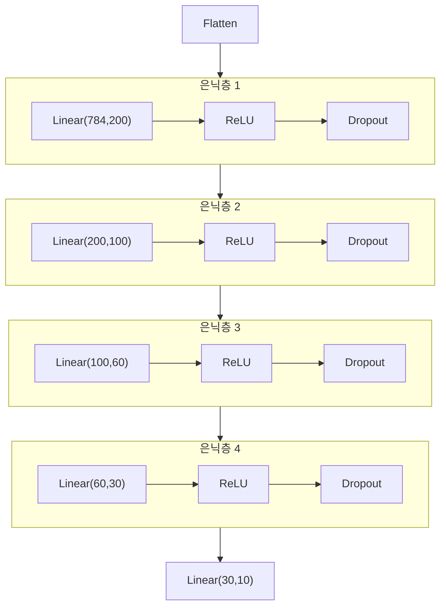

> [!note]- Supplementary Materials
> **인공지능**
> - [[07_Classification]] (메인 자료)
> - [TensorFlow Neural Network Playground](https://playground.tensorflow.org)
> 
> **PyTorch**
> - [[04_CEE (MNIST)]]
> 
> **LG AI연구원 8기**
> - [[01_머신러닝과 딥러닝의 기초]]
> 
> **LG AI연구원 9기** - Supervised Learning
> - [[04_Classification]]
> - [[05_Logistic Regression]]

## 1. MNIST 학습 모델 발전 단계
- 흐름
	- 손실함수 개선(MSE→CEE)
	- → 신경망 깊이(Deep)
	- → 활성함수 개선(Sigmoid→ReLU)
	- → 일반화 기법(Dropout)
	- → 구조 개선(FCN→CNN)

|      모델       |  활성함수   |       기법       |  정확도   |
| :-----------: | :-----: | :------------: | :----: |
| 1-layer + MSE |    -    |       -        | 91.2%  |
| 1-layer + CEE |    -    |       -        | 92.1%  |
| 5-layer + CEE | Sigmoid |      Adam      | 97.36% |
| 5-layer + CEE |  ReLU   |      Adam      | 98.13% |
| 5-layer + CEE |  ReLU   | Adam + Dropout | 98.20% |

### 1.1. 1-Layer + CEE (TH125)
> 분류 문제에 적합한 **Cross-Entropy** 손실함수 도입
> 출력층에 **Softmax**를 사용하여 확률분포로 변환

- MSE 대비 약간 개선 → **정확도 92.1%**

- PyTorch의 `CrossEntropyLoss()`는 내부적으로 Softmax 포함
	- → 학습 시 모델에 `nn.Softmax()`를 넣지 말 것 (학습 효율 저하)
	- → 추론 시에는 Softmax 사용 가능

### 1.2. 5-Layer Deep NN + Sigmoid + Adam (TH300)
- 구조: 784 → 200 → 100 → 60 → 30 → 10
- **정확도 97.36%** 로 크게 개선
- 문제점: **학습 시작이 매우 느림 (slow start)**

#### (1) Adam
- **Adam**(adaptive moment estimation)

#### (2) Vanishing Gradient 문제
> **Sigmoid** 사용 시 층이 깊어질수록 학습이 안 되는 **기울기 소실(Vanishing Gradient)** 현상 발생 (초반 학습 느림)

> **경사 소실(Vanishing Gradient) 문제**
> 역전파할 때 기울기(gradient)가 너무 작아져서 가중치가 거의 업데이트되지 않는 현상

- Sigmoid 양 끝단에서 gradient가 0에 수렴
- 깊은 신경망의 input layer 쪽으로 갈수록 gradient 소실
    - 예: (0.3)¹⁰ = 0.000006
- Sigmoid의 최대 gradient = 0.3
- **해결책**: ReLU 또는 PReLU 사용 (양의 구간에서 gradient = 1 유지)

### 1.3. 5-Layer + ReLU + Adam (TH310)
- *Sigmoid 대신* ReLU 적용으로 slow start 문제 해결
- **정확도 약 98.13%**
- 새로운 문제: **과적합(Overfitting) 발생**
	- *훈련 데이터에는 너무 잘 맞지만 새로운 테스트 데이터에는 성능이 떨어지는 현상*

#### (1) Dropout 적용 (TH320)
- **드롭아웃**(Dropout)
	- 학습 시 뉴런의 일부를 랜덤하게 비활성화 → 더 작은 sub-network로 학습
	- ==과적합(Overfitting) 문제 개선== (정확도 약 98.20%)

- 일반적으로 p = 20% ~ 50%
- **학습 시(`model.train()`)만 활성화**, 추론 시(`model.eval()`)는 자동으로 비활성화

- 모델 구조 예시 (Dropout 적용)

