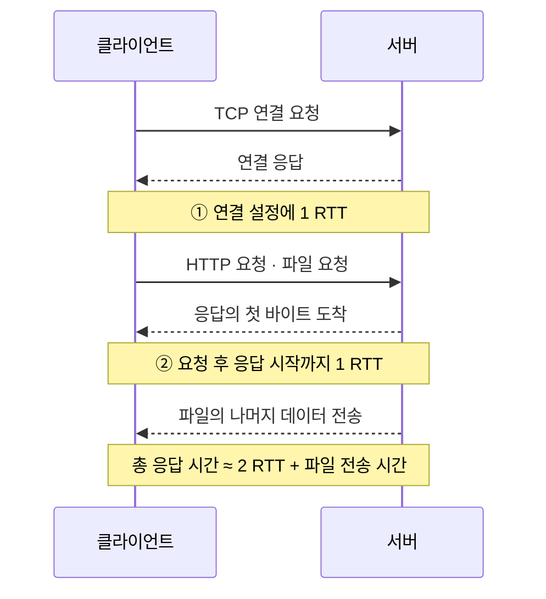

---
aliases:
type: Ontology
tags:
  - Networks
draft: false
up:
  - "[[HTTP 요청]]"
  - "[[HTTP 응답]]"
prev:
  - "[[URI (URL, URN)]]"
same:
next:
  - "[[HTTP 상태 코드]]"
down:
---
## HTTP/1.0 (비지속 연결)
본격적으로 현재의 HTTP 형태를 갖추기 시작한 버전이다.

- 헤더(Header) 도입: 요청 및 응답에 메타데이터(콘텐츠 타입, 인코딩 등) 추가 가능
- 미디어 타입 확장: HTML 외에도 이미지, 오디오, 동영상, 텍스트 문서 전송 가능 (Content-Type)
- 메서드 확장: GET, POST, HEAD 지원
- 상태 코드 도입: 요청의 성공/실패 여부를 코드로 전달

- **한계**: 요청마다 매번 TCP 연결(3-Way Handshake)을 맺고 끊는 단기 연결(Short-lived Connection) 방식이라 네트워크 오버헤드가 큼

### 동작
`www.someSchool.edu/someDepartment/home.index` 접속
(기본 텍스트 파일 + 10개 jpeg 이미지 참조 가정)

1. **(1a)** HTTP 클라이언트는 TCP 연결을 개시하고 HTTP 서버(80번 포트)로 접속을 시도한다.
   **(1b)** 서버는 80번 포트로 연결 대기 중이며, 클라이언트 연결이 확인되면 수락한다.
2. 클라이언트는 TCP 연결 소켓을 통해 요청 객체(`someDepartment/home.index`)가 포함된 **request message**를 전달한다.
3. 서버는 요청 메시지 수신 후 요청한 객체가 포함된 **response message**를 생성하고 소켓을 통해 전송한다.
4. 서버는 TCP 연결을 종료한다.
5. 클라이언트는 HTML 파일이 포함된 응답 메시지를 받아 표시하고, 파싱한 결과 **10개 jpeg 객체의 참조 주소**가 포함된 것을 확인한다.
6. 10개 jpeg 객체를 얻기 위해 **1 ~ 5 단계를 10번 반복**한다.

### 응답 시간
**RTT (Round-Trip Time)**
- 클라이언트에서 생성한 단위 패킷이 서버로 갔다가 되돌아올 때까지의 왕복 소요 시간

**HTTP 응답 시간**
- TCP 연결 개시 RTT + HTTP 요청/응답 처리 RTT + 파일 전송 시간

**비지속 연결 HTTP 응답 시간**
- $2 \times RTT + \text{파일 전송 시간}$

## HTTP/1.1 (지속 연결)
| 구분              | 비지속 연결 HTTP (HTTP 1.0)              | 지속 연결 HTTP (HTTP 1.1)                |
| --------------- | -------------------------------------- | --------------------------------------- |
| 절차              | TCP 연결 설정 → 1개 객체 전달 → TCP 연결 해제 | TCP 연결 설정 → 다수 객체 송수신 → TCP 연결 해제 |
| 다수 객체 다운로드 시 | 매번 연결해야 하므로 **다수의 연결 필요**              | **1개의 연결**을 오픈 상태로 유지하고 재사용             |

지금까지도 널리 사용되는 웹의 핵심 기반이다.

- Persistent Connection (Keep-Alive): 한 번 맺은 TCP 연결을 끊지 않고 여러 요청/응답을 재사용
- Pipelining: 이전 응답을 기다리지 않고 연속으로 여러 요청을 보낼 수 있는 기능 (단, 응답은 요청 순서대로 와야 함)
- 호스트 헤더(Host Header): 하나의 IP 주소에서 여러 도메인을 호스팅 가능 (가상 호스팅)
- 추가 메서드: PUT, DELETE, OPTIONS, PATCH 등 지원
- 캐시 제어 메커니즘 강화

- HOLB(Head-of-Line Blocking): 앞선 요청의 처리가 지연되면 뒤따르는 요청들도 모두 대기해야 하는 문제
- 무거운 헤더: 요청마다 중복된 쿠키 및 메타데이터를 평문으로 전송해 대역폭 낭비

비지속 연결 HTTP의 문제
- 각 객체 당 2개의 RTT 필요
- 각 TCP 연결 처리를 위한 **운영체제 오버헤드** 발생
- 브라우저는 참조 객체를 가져오기 위해 순차적으로 TCP 연결을 시도함

지속 연결 HTTP의 개선
- 서버는 응답 전송 후 연결을 **오픈 상태로 유지**한다.
- 후속 HTTP 메시지는 오픈된 연결을 통해 송수신된다.
- 클라이언트는 참조 객체가 확인되면 즉시 요청을 시도한다.
- **1개의 RTT 수준**으로 모든 참조 객체를 처리할 수 있다.

## HTTP/2 (프레임 분할)
구글의 **SPDY** 프로토콜을 기반으로 HTTP/1.1의 성능 한계를 극복하기 위해 설계되었다.

- 바이너리 프레이밍(Binary Framing): 텍스트 대신 바이너리(0과 1) 단위로 메시지를 분할 및 캡슐화하여 파싱 속도 향상
- 멀티플렉싱(Multiplexing): 단일 TCP 연결 안에서 여러 개의 독립된 스트림(요청/응답)을 동시에 병렬 처리 (HTTP 레벨의 HOLB 해결)
- 헤더 압축 (HPACK): 중복 헤더를 압축하여 전송 데이터양을 대폭 절감
- 서버 푸시(Server Push): 클라이언트가 요청하지 않아도 HTML 렌더링에 필요한 리소스(CSS, JS 등)를 서버가 미리 전송
- 스트림 우선순위(Stream Prioritization): 중요한 리소스를 먼저 로드하도록 지정 가능

- 한계: HTTP 레벨의 HOLB는 해결했으나, 기반이 되는 TCP 자체의 패킷 손실 시 발생하는 HOLB는 여전히 존재

> [!important] 목적
> 다중 HTTP 객체 요청 시 **지연 감소**

HTTP 1.1의 문제
- 단일 TCP 연결 상에 다중, 파이프라인 형태로 GET을 처리한다.
- 서버는 GET 요청에 따라 순차 회신한다. → **FCFS(first-come-first-served) 스케줄링**
- FCFS 적용 시, 대기열 앞에 있는 긴 객체 전송이 완료될 때까지 뒤의 짧은 객체는 대기해야 한다.
- → **HOL(head-of-line) 블로킹** 발생
- 긴 객체가 전송 손실로 재전송될 경우 상황이 더 악화된다.

HTTP/2 [RFC 7540, 2015]
- 서버에서 클라이언트로 다중 객체 전송 시 **유연성 향상**
- 객체를 **프레임으로 분할**하고 프레임 단위로 전송 (프레임들이 섞여서 전송됨)
- 클라이언트에서 지정한 **객체 우선 순위**에 따라 전송 순서 결정 (FCFS 지원하지 않음)
- HTTP 1.1 형식 유지: 메서드, 상태 코드, 대부분의 헤더 필드
- **푸시(push)**: 요청하지 않은 객체를 추가로 클라이언트에 전송

| 프로토콜        | 1개의 긴 객체($O_1$) + 3개의 짧은 객체 요청 시 |
| ----------- | ------------------------------- |
| **HTTP 1.1** | $O_1$ 전송 이후 $O_2, O_3, O_4$ 순으로 전송 |
| **HTTP/2**   | $O_2, O_3, O_4$ 먼저 전송되고 이어서 $O_1$ 지연 전송 |

## HTTP/3 (파이프라이닝)
전송 계층 프로토콜을 TCP에서 **UDP 기반의 QUIC** 프로토콜로 전면 교체한 최신 표준이다.

- QUIC (UDP 기반) 사용: TCP의 3-Way Handshake + TLS 연결 과정을 한 단계로 통합 (0-RTT 또는 1-RTT 연결 수립 지원)
- 완전한 HOLB 해결: 각 스트림이 전송 계층에서도 완전히 독립적이므로, 한 패킷이 유실되어도 다른 스트림에 영향을 주지 않음
- Connection ID 기반 연결 유지: Wi-Fi에서 모바일 데이터(LTE/5G)로 네트워크가 전환되어도 IP 변경과 상관없이 연결이 끊기지 않고 유지됨
- 기본 보안 내장: TLS 1.3이 프로토콜 자체에 기본으로 내장되어 암호화가 강제됨
- QPACK: QUIC의 비순차적 패킷 전달 특성에 맞춘 헤더 압축 알고리즘 도입

단일 TCP 연결 상의 HTTP/2 문제
- **단일 패킷 손실로 모든 전송이 손실**된다.
	- HTTP 1.1처럼, 브라우저는 다중 병행 TCP 연결을 사용하여 손실을 감소시키고 성능 향상을 선택할 수 있다.
	- 바닐라 TCP 연결은 보안 기능이 없다.

**HTTP/3**: UDP 상에 파이프라이닝을 이용하여 보안 기능, 객체 단위 에러 및 혼잡 제어 추가
- 전송 계층 기능을 HTTP/3에 구현한다.
- **QUIC(Quick UDP Internet Connections)** 는 UDP를 사용하며 2개의 종단점 간 수많은 다중화 연결을 지원한다.
